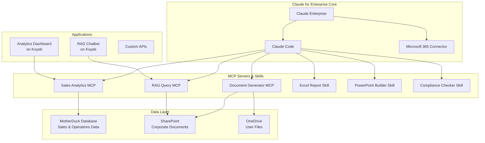

```mermaid

graph TB
    subgraph "Claude for Enterprise Core"
        CE[Claude Enterprise]
        CC[Claude Code]
        M365[Microsoft 365 Connector]
    end
    
    subgraph "Data Layer"
        MD[MotherDuck Database<br/>Sales & Operations Data]
        SP[SharePoint<br/>Corporate Documents]
        OD[OneDrive<br/>User Files]
    end
    
    subgraph "MCP Servers & Skills"
        MCP1[Sales Analytics MCP]
        MCP2[Document Generator MCP]
        MCP3[RAG Query MCP]
        SK1[Excel Report Skill]
        SK2[PowerPoint Builder Skill]
        SK3[Compliance Checker Skill]
    end
    
    subgraph "Applications"
        RAG[RAG Chatbot<br/>on Koyeb]
        DASH[Analytics Dashboard<br/>on Koyeb]
        API[Custom APIs]
    end
    
    CE --> M365
    CE --> CC
    CC --> MCP1
    CC --> MCP2
    CC --> MCP3
    CC --> SK1
    CC --> SK2
    CC --> SK3
    
    MCP1 --> MD
    MCP2 --> SP
    MCP2 --> OD
    MCP3 --> SP
    
    RAG --> MCP3
    DASH --> MCP1
```