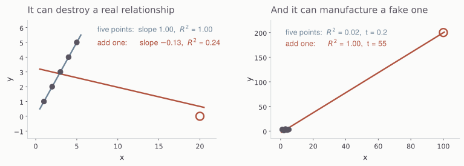

## Today

::: {.steps}
1. Fit a linear regression to predict multiples
2. Filtering, transforming variables
3. Train/test split and out-of-sample goodness of fit
:::

## Data: session4.parquet {.plain-title}

::: {.lead}
Today's data, 4161 rows.
:::

| | |
|-------|-----------------------------|
| Multiples | ps, pb, pe, evebitda |
| Denominators | revenue, book value, net income, EBITDA |
| Industry variables | SIC4, SIC3, SIC2, industry, famaindustry, sector |
| Ratios | net margin, gross margin, EBITDA margin, asset turnover, ROE, ROA, ROIC, debt-to-equity, current ratio, payout ratio, dividend yield |
| Growth | year-over-year sales growth |
| Size | marketcap |

::: {.note .note-plum}
Ask AI to describe `session4.parquet` and confirm that it contains this data.
:::

## Linear Regression

::: {.steps}
1. Ask AI to use the statsmodels library to regress ps on the ratios and sales growth.
2. Think about what you want to do with negative ps firms and tell AI. Or discuss it with AI.
3. Analyze the regression output.
:::

## Industry Membership {.plain-title}

::: {.lead}
Including industry dummy variables (1 if in industry, 0 if not, for each
industry) allows the intercept of the regression to vary by industry.
:::

::: {.note .note-plum}
Ask AI what industry variable it recommends using. Then ask it to run the
regression with statsmodels and to evaluate the goodness of fit.
:::

# The Effect of Outliers

## Both Directions {.no-title}

{.nostretch width="100%"}

::: {.note .note-plum}
Six points either way, and least squares has no way of telling you which of
these two pictures it is looking at. It reports the same kind of R-squared for
both.
:::

## It Destroys a Real Relationship {.plain-title .compare}

| x | 1 | 2 | 3 | 4 | 5 | | 20 |
|---|---|---|---|---|---|---|---|
| y | 1 | 2 | 3 | 4 | 5 | | 0 |

:::: {.columns}
::: {.column width="50%"}
[Five points]{.eyebrow}

Slope 1.00, R-squared 1.00. A perfect line.
:::

::: {.column width="50%"}
[Add the sixth]{.eyebrow}

Slope -0.13, R-squared 0.24. The sign is now wrong.
:::
::::

## And It Invents One That Is Not There {.band-bottom}

| x | 1 | 2 | 3 | 4 | 5 | | 100 |
|---|---|---|---|---|---|---|---|
| y | 3 | 1 | 4 | 2 | 3 | | 200 |

::: {.cards .cards-2}
::: {.card}
[Five points of noise]{.card-title}

R-squared 0.019, t = 0.24. Correctly, nothing.
:::

::: {.card .card-blue}
[Add the sixth]{.card-title}

R-squared 0.999, t = 55. A perfect fit through one observation.
:::
:::

::: {.note .note-plum}
Six points here, and a few thousand in the file. It does not take many.
:::

# Variable Transformations

## The Moves {.band-bottom}

::: {.cards .cards-3}
::: {.card}
[Winsorize]{.card-title}

Clip each variable at its 1st and 99th percentile. Keeps the company, discards
the magnitude.
:::

::: {.card .card-blue}
[Standardize]{.card-title}

Subtract the mean, divide by the standard deviation. Puts every variable on the
same scale.
:::

::: {.card}
[Log]{.card-title}

Take logs. Converts right-skewed distributions (marketcap, household income, ...) into more symmetric ones.
:::
:::

::: {.note}
They are not interchangeable, and only two of the three will do anything to an
OLS R-squared.
:::

## Winsorizing {.plain-title}

| | values | mean | std |
|---|---|---|---|
| Raw | 1, 2, 3, 4, 1000 | 202.0 | 446.1 |
| Clipped at 4 | 1, 2, 3, 4, **4** | 2.8 | 1.3 |

::: {.note .note-plum}
The company stays in the sample and keeps its rank. What it loses is the ability
to dominate a sum of squares. Winsorizing is a statement that you believe the
ordering and not the size.
:::

## Logs

| | values |
|---|---|
| Raw | 1, 2, 3, 4, 1000 |
| Log | 0.00, 0.69, 1.10, 1.39, **6.91** |

::: {.note}
A thousand is a thousand times the smallest value and seven times its log. Taking logs is useful for right-skewed variables.
:::

## Standardizing {.plain-title}

| | values | mean | std |
|---|---|---|---|
| Raw | ninety-nine 0.5s, and one 3374 | 34.2 | 335.7 |
| Standardized | ninety-nine -0.1005s, and one 9.95 | 0.0 | 1.0 |

::: {.lead}
Standardizing is a linear change of variables, and OLS is invariant to it. The
coefficients move and are easier to compare across variables, but the predictions of the dependent variable do not change.
:::

## Re-run the regression

::: {.lead}
Talk with AI about which transformations might be useful for which variables.
Then re-run the regression.
:::

::: {.note .note-plum}
How do coefficients, t-stats, and the R-squared change?
:::

# Out of Sample Performance

## Machine Learning {.plain-title}

::: {.lead}
Machine learning deals with the following type of situation.
:::

- In the future, I will have some data.  I want to use it to make a prediction about another variable.
- I also have past data on the predictors (x variables) and the dependent variable (y).
- I want to build a model using the past data that predicts y from the x variables.
- In the future, I will use the model to make predictions.

::: {.note .note-plum}
What machine learning cares about is how well a model trained (fitted) on past
data will perform on future data. This is out-of-sample performance, because the
future x's and y are not part of the sample used to build the model.
:::

## Train-Test Split

::: {.lead}
To assess expected out-of-sample performance, we withhold some of our current
data when training. We use the held-out data to test the model.
:::

::: {.steps}
1. Ask AI to use scikit-learn to do a train-test split, to transform features (x variables) on the training data, apply the same transformations on the test data, and determine goodness of fit on the test data.
2. Ask AI to create an html doc explaining what was done and explaining the performance on the test data.
:::

## Assignment for Tuesday {.band-bottom}

::: {.lead}
Can we trade on this? Use `session4_monthly.parquet`. In each row, everything
except the return is known at the beginning of the month.
:::

::: {.steps}
1. Run a linear regression each month, using some multiple on the left-hand side. Use scikit-learn, but do not use train-test splits. Our test will be whether we make money.
2. Sort stocks each month based on the regression error. If the left-hand side is ps, or log ps, then positive errors (ps > predicted) are expensive firms. You would want to buy stocks with the "most negative" errors.
3. Form a portfolio each month and compute its return. Evaluate the returns of the strategy --- annualized mean, Sharpe ratio, CAPM alpha, ...
:::

::: {.note .note-plum}
Be prepared to present on Tuesday --- slides if you want them but be prepared to
dig into the analysis.
:::
