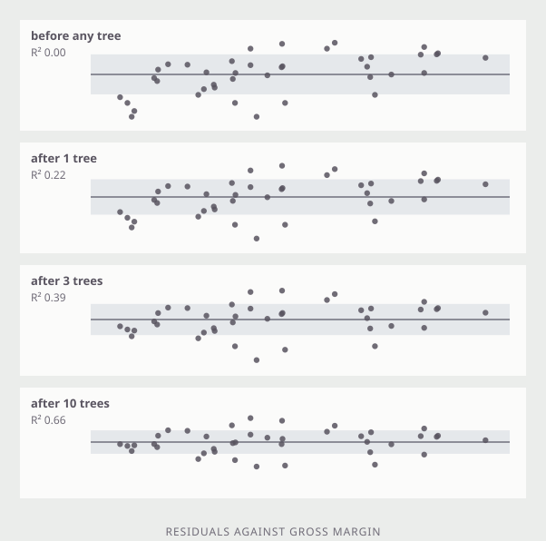
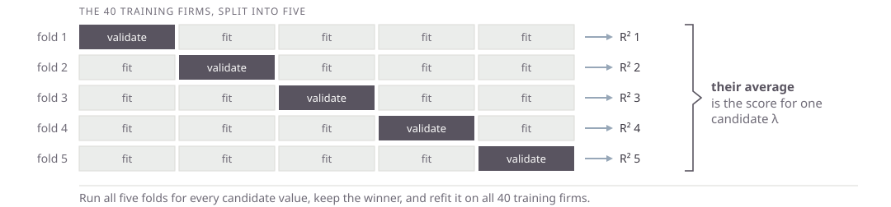

## Empirical Asset Pricing via Machine Learning {.plain-title}

::: {.lead}
*The Review of Financial Studies*, February 2020.
:::

::: {.cards .cards-3}
::: {.card}
[Shihao Gu]{.card-title}

Booth School of Business, University of Chicago
:::

::: {.card .card-blue}
[Bryan Kelly]{.card-title}

Yale University; Head of Machine Learning, AQR
:::

::: {.card}
[Dacheng Xiu]{.card-title}

Booth School of Business, University of Chicago
:::
:::

::: {.note .note-plum}
A horse race: one task, one dataset, a dozen methods scored side by side.
Predict next month's return for every U.S. stock from roughly 900 signals ---
94 firm characteristics, their interactions with eight macro series, and
industry dummies --- and grade each method by out-of-sample $R^2$. Trees and
neural networks win, and the gains come from interactions a linear model cannot
see. A value-weighted long-short decile spread on the neural network forecasts
earns an out-of-sample Sharpe ratio of 1.35.
:::

## Today

::: {.steps}
1. Ridge and lasso --- linear regression with a penalty on the coefficients
2. Hyperparameters
3. Cross validation
4. Regression trees and gradient boosting
5. Predicting a multiple from characteristics
:::

## Today's Example {.plain-title}

::: {.lead}
We will use `session4.parquet` to predict the log of the price-to-sales ratio.
:::

| | |
|---|---|
| `grossmargin` | gross margin |
| `ebitdamargin` | EBITDA margin |
| `netmargin` | net margin |
| `assetturnover` | asset turnover |
| `rndint` | R&D / sales |
| `currentratio` | current ratio |
| `growth` | sales growth |
| `de` | debt / equity |

## Root Mean Squared Error {.plain-title .compare}

::: {.lead}
A standard deviation measures spread around a mean. RMSE measures spread around
a prediction, and it is the same arithmetic.
:::

:::: {.columns}
::: {.column width="50%"}
[Standard deviation of a sample]{.eyebrow}

$$s_x \;=\; \sqrt{\frac{1}{n}\sum_{i=1}^{n}\left(x_i - \bar{x}\right)^{2}}$$
:::

::: {.column width="50%"}
[Root mean squared error]{.eyebrow}

$$\text{RMSE} \;=\; \sqrt{\frac{1}{n}\sum_{i=1}^{n}\left(y_i - \hat{y}_i\right)^{2}}$$
:::
::::

::: {.note}
Each point's own prediction $\hat{y}_i$ takes the place of the one number
$\bar{x}$.
:::

## R-Squared {.plain-title}

::: {.lead}
The squared error you removed, over the squared error you started with.
:::

$$R^{2} \;=\; \frac{\dfrac{1}{n}\sum_{i}\left(y_i - \bar{y}\right)^{2} \;-\; \dfrac{1}{n}\sum_{i}\left(y_i - \hat{y}_i\right)^{2}}{\dfrac{1}{n}\sum_{i}\left(y_i - \bar{y}\right)^{2}}$$

$$R^{2} \;=\; \frac{\text{variance} \;-\; \text{mean squared error}}{\text{variance}}$$

## One Small Example {.plain-title}

::: {.lead}
Every app today is fitted to the same 40 firms and scored on the same 120, all
with market cap above \$2b.
:::

::: {.note}
Forty is small on purpose. Everything that goes wrong with a thousand features
and ten thousand rows goes wrong here too, and here you can watch it happen.
:::

# Least Squares

## What OLS Is Doing

::: {.lead}
Pick the coefficients that make the sum of squared errors on the training data
as small as possible. Nothing else is asked of them.
:::

::: {.stats}
::: {.stat}
[0.68]{.stat-value}
[train R-squared]{.stat-label}
:::
::: {.stat}
[0.44]{.stat-value}
[test R-squared]{.stat-label}
:::
::: {.stat}
[8]{.stat-value}
[features, 40 firms]{.stat-label}
:::
:::

::: {.note .note-plum}
The fit was chosen to make the first number large. The second is what it is
worth on firms it has not seen.
:::

## Multi-Collinearity {.band-bottom}

::: {.lead}
Net margin and EBITDA margin have a correlation of 0.82 across these firms.
Least squares is asked which of them explains P/S, and the data cannot say.
:::

| | OLS coefficient |
|---|---|
| net margin | +0.63 |
| EBITDA margin | &minus;0.27 |

::: {.note}
A large positive on one and a negative on its near-twin.
:::

# Ridge

## The Ridge Criterion {.plain-title}

$$\min_{\beta} \; \sum_{i=1}^{n} \left( y_i - \beta_0 - \sum_j \beta_j x_{ij} \right)^{2} \;+\; \lambda \sum_j \beta_j^{2}$$

::: {.cards .cards-3}
::: {.card}
[The second term]{.card-title}

A price on size. Large coefficients now have to earn their keep.
:::

::: {.card .card-blue}
[Standardize first]{.card-title}

One penalty for all the coefficients only works if the features share a scale.
:::

::: {.card}
[Not the intercept]{.card-title}

$\beta_0$ is left out of the sum. Shrinking it would just move the whole fit.
:::
:::

::: {.note .note-plum}
$\lambda$ is a hyperparameter --- a number you set before fitting, rather than one
the fitting picks for you. The $\beta$'s are parameters and come out of the data;
$\lambda$ decides how hard the data has to argue for them.
:::

## Ridge

```{=html}
<div class="s5app" data-s5app="ridge"></div>
```

## What the Slider Showed {.band-bottom}

::: {.cards .cards-3}
::: {.card}
[Everything shrinks]{.card-title}

Toward zero, together. At $\lambda = 0$ the fit is exactly OLS; the gold ticks
are where it started.
:::

::: {.card .card-blue}
[The twins converge]{.card-title}

+0.63 and &minus;0.27 become +0.15 and +0.13. Ridge splits the credit rather
than picking a winner.
:::

::: {.card}
[Nothing reaches zero]{.card-title}

Ridge shrinks every coefficient and drops none. All eight features stay in the
model.
:::
:::

::: {.note .note-plum}
Test R-squared climbs from 0.44 to 0.66 and then falls away again. The training
R-squared drops the whole way.
:::

# Lasso

## The Lasso Criterion {.plain-title}

$$\min_{\beta} \; \sum_{i=1}^{n} \left( y_i - \beta_0 - \sum_j \beta_j x_{ij} \right)^{2} \;+\; \lambda \sum_j \left| \beta_j \right|$$

::: {.lead}
One character different, and the behavior is not the same. Squaring makes the
penalty on a small coefficient negligible; the absolute value does not.
:::

::: {.note}
A coefficient that is not paying for itself is pushed all the way to zero and
stays there.
:::

## The Shape of the Penalty

```{=html}
<div class="s5app" data-s5app="penalty"></div>
```

::: {.note .note-plum}
Near zero the square has nothing left to charge; the absolute value still charges
full price.
:::

## Lasso

```{=html}
<div class="s5app" data-s5app="lasso"></div>
```

# Regression Trees

## How a Tree Fits {.plain-title}

::: {.steps}
1. Search every feature and every cut point for the one split that reduces the sum of squared errors the most.
2. Cut the sample in two on that rule.
3. Repeat inside each piece, and inside the pieces of those pieces.
4. Predict the average of the training firms that land in each final piece.
:::

::: {.note}
No linear form is assumed, so a tree handles a kink or a threshold that a
regression has to be told about. The next two slides use gross margin and net
margin, because two is the most you can draw.
:::

## Splitting on Two Features

```{=html}
<div class="s5app" data-s5app="splits"></div>
```

::: {.note}
Each cut is chosen over both variables at once. The winner is whichever single
line, in whichever variable, increases the training $R^2$ the most.
:::

## One Tree

```{=html}
<div class="s5app" data-s5app="tree2"></div>
```

::: {.note .note-plum}
The boxes and the tree are the same object. A path down the tree is a box; a
leaf's colour is the average of the firms that landed in it.
:::

## Hyperparameters to Control Overfitting {.band-bottom}

::: {.cards .cards-2}
::: {.card}
[Max depth]{.card-title}

How many cuts deep the tree may go. Depth $d$ allows up to $2^d$ leaves; depth 8
here gives 28 boxes for 40 firms.
:::

::: {.card .card-blue}
[Minimum per leaf]{.card-title}

The smallest number of training points a leaf may hold. A leaf of one is a
memorized observation.
:::
:::

::: {.note .note-plum}
At depth 2 the tree scores 0.57 on the training firms and 0.29 on the test
firms. At depth 8 it scores 0.96 and $-0.14$ --- worse than a flat line at the
average.
:::

# Gradient Boosting

## The Idea {.plain-title}

::: {.steps}
1. Start by predicting the training mean for everyone.
2. Compute the residuals --- what the current prediction is missing.
3. Fit a small tree to the residuals.
4. Add a fraction of that tree, the learning rate, to the prediction.
5. Go back to step 2.
:::

::: {.note}
No single tree is any good. The sum of a few hundred deliberately weak ones is
the model that wins most tabular prediction contests. Back to one feature here,
so the sum can be drawn as a curve.
:::

## Fitting the Residuals {.image-left}

::: {.image-panel}

:::

::: {.content-panel}
[What each tree is given]{.eyebrow}

Every tree after the first is fitted to what the ones before it got wrong.

What rises is the training $R^2$: nothing before any tree, 0.66 after ten.

No one of these trees is a model. The sum of them is.
:::

## Important Hyperparameters {.band-bottom}

::: {.cards .cards-3}
::: {.card}
[Number of trees]{.card-title}

The only knob that keeps improving the training fit forever. Test R-squared
peaks early --- here, after about five.
:::

::: {.card .card-blue}
[Learning rate]{.card-title}

How much of each tree is added. Small rates need more trees and usually end up
better.
:::

::: {.card}
[Depth]{.card-title}

How much each tree may do on its own. Two or three is standard; the boosting is
supposed to do the work.
:::
:::

::: {.note .note-plum}
Halve the learning rate and you roughly double the number of trees you need. Set
the rate low, then stop adding trees when validation R-squared stops rising. Min
observations per leaf is also important. We set it to 1 here for simplicity.
:::

## Gradient Boosting

```{=html}
<div class="s5app" data-s5app="boost"></div>
```

## Every Boosting Hyperparameter {.plain-title}

:::: {.columns}
::: {.column width="50%"}
[How much ensemble]{.eyebrow}

- `n_estimators` --- how many trees
- `learning_rate` --- shrinkage per tree
- `subsample` --- rows per tree
- `loss` --- squared, absolute, huber
- `n_iter_no_change` --- early stopping
:::

::: {.column width="50%"}
[How much tree]{.eyebrow}

- `max_depth` --- how deep
- `max_leaf_nodes` --- or how many
- `min_samples_leaf` --- smallest box
- `min_samples_split` --- node minimum
- `max_features` --- features per split
:::
::::

::: {.note}
All are set before fitting. Tune the first three and leave the rest alone.
:::

## Which Features Mattered {.band-bottom}

::: {.lead}
Boosting will tell you which features its trees actually used.
:::

:::: {.columns}
::: {.column width="44%"}
| | |
|---|---|
| net margin | 0.25 |
| R&D / sales | 0.23 |
| gross margin | 0.15 |
| sales growth | 0.14 |
| EBITDA margin | 0.13 |
| debt / equity | 0.04 |
| current ratio | 0.03 |
| asset turnover | 0.02 |
:::

::: {.column width="56%"}
[Where the numbers come from]{.eyebrow}

The fraction of the total training error removed that each feature is
responsible for, based on error reduction at each split in each tree.

[What they do not say]{.eyebrow}

Not the sign of the effect --- only that the feature got used. Two features that
move together split the credit between them, so neither looks essential.
:::
::::

::: {.note}
`model.feature_importances_`, in the order of the feature columns. Here: 200
trees, rate 0.1, depth 2, test $R^2$ of 0.60.
:::

# Selecting Hyperparameters

## Cross-Validation

::: {.lead}
Split the training sample into 5 subsets. For each hyperparameter value, fit on
4, test (validate) on the 5th. Repeat across all 5 folds. Choose the
hyperparameter with the best average performance on the 5 validation folds.
:::

{.nostretch width="100%"}

# Exercise

## Hands On

::: {.steps}
1. Use `session4.parquet` and do a train/test split.
2. Train `LinearRegression`.
3. Use `GridSearchCV` to find the optimal `n_estimators`, `learning_rate` and `max_depth` hyperparameters for `GradientBoostingRegressor`.
4. Report the $R^2$ on the test sample for both methods.
:::

::: {.note .note-plum}
Tell AI to do it. You do not need to name `LinearRegression`, `GridSearchCV`, or
`GradientBoostingRegressor`. You could just say your goal is to test linear
regression and gradient boosting to predict `ps` from the ratios and sales
growth.
:::

## Refit and Save Your Models {.band-bottom}

::: {.steps}
1. Refit `LinearRegression` on the entire sample.
2. Rerun `GridSearchCV` for `GradientBoostingRegressor` on the entire sample.
3. Save both refit models.
:::

::: {.note .note-plum}
We will use the models to build Stock Recommender apps on Thursday. Ask AI to
save them with `joblib.dump` and to check that they load back.
:::
