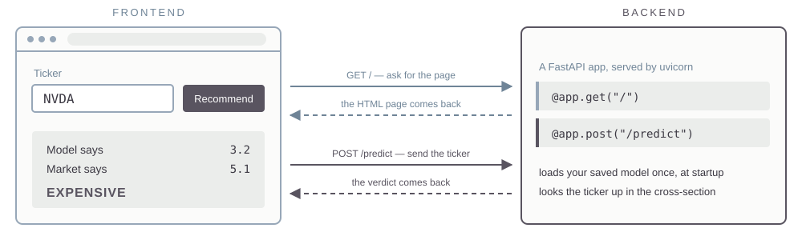

## Today {.plain-title}

::: {.lead}
You have two fitted models sitting in a file. Today you wrap them in something a
person who has never opened Python can use.
:::

::: {.steps}
1. How software works.
2. What we might want in a stock recommender app.
3. Deploying an app.
:::

# How Software Works

## Frontend and Backend

:::: {.columns}
::: {.column width="50%"}
[Frontend]{.eyebrow}

The browser. HTML, CSS, and JavaScript --- it draws the page and collects the
clicks.
:::

::: {.column width="50%"}
[Backend]{.eyebrow}

A program on a server that listens continuously for requests. Yours will be
Python.
:::
::::

::: {.lead}
You open a URL. The browser sends a GET request. The server sends back the
HTML, CSS, and JavaScript it was written to send. The browser interprets that
and shows you a page.
:::

::: {.note}
Right-click any web page and choose View Page Source. That is the frontend
code, exactly as the backend handed it over.
:::

## Then You Click Something {.plain-title}

::: {.lead}
A POST request carries data the other way --- a form, a ticker you typed. The
server does what it was written to do and replies.
:::

{.nostretch width="90%" fig-align="center"}

## Running Locally {.band-bottom}

::: {.lead}
The backend and the frontend can be the same computer --- lab638, or your own
laptop if you have Python installed on it.
:::

::: {.cards .cards-2}
::: {.card}
[localhost]{.card-title}

`127.0.0.1` is the loopback address. The browser asks the machine it is already
running on, and the request never reaches a network.
:::

::: {.card .card-blue}
[Ports]{.card-title}

One machine can run many programs listening at once. The port number tells the
operating system which of them gets the request.
:::
:::

::: {.note .note-plum}
You write the app as a `.py` file. FastAPI is the dominant Python library for
writing one; uvicorn runs it and starts it listening on a port:
`python3 -m uvicorn app:app --reload`.
:::

# Stock Recommender App

## Basic Design

::: {.steps}
1. The app loads the saved linear regression and gradient boosting models at startup. It does not refit anything in real time.
2. The user types a ticker.
3. The app pulls that company's row, runs the models, and compares the actual `ps` to the warranted `ps` the models predict.
4. It answers: Strong Buy, Buy, Hold, Sell, or Strong Sell.
:::

## Demo vs Production {.plain-title}

::: {.cards .cards-2}
::: {.card}
[The demo]{.card-title}

The models and `session4.parquet` ship inside the app. It is a snapshot ---
the same rows every time anyone opens it.
:::

::: {.card .card-blue}
[Production]{.card-title}

The session 4 data would be updated daily, and the models refit periodically as
new data accumulates.
:::
:::

## Questions {.band-bottom}

:::: {.columns}
::: {.column width="50%"}
[The verdict]{.eyebrow}

- What cutoffs? How big a gap makes it a Strong Buy rather than a Buy?
- Both models, one of them, or the average of the two?
:::

::: {.column width="50%"}
[The comparison]{.eyebrow}

- The whole cross-section, and where the ticker falls in it?
- Against its own industry?
- Against companies of its size?
:::
::::

::: {.note}
Argue these out with AI before you write code.
:::

# Deploying an App

## Platform as a Service

::: {.lead}
You hand a host your repository. It builds the app, runs it, and puts it behind
a public URL --- there is no server for you to administer. Railway, Render,
Koyeb, and Heroku all do this. We will use Koyeb, which has a free tier.
:::

::: {.steps}
1. Create a free account at `koyeb.com`.
2. In the control panel, create an API access token. Koyeb shows it once, so copy it then.
3. In a terminal, add it to your `.env` file:
:::

```bash
printf '\nKOYEB_ACCESS_TOKEN=your_access_token\n' >> $HOME/.env
```

::: {.note}
`>>` appends, and creates the file if you do not have one. Koyeb's web UI will
link a GitHub repo with no token at all --- the token is what lets AI do the
deploying for you, which is the path we are taking.
:::

## Deploy the App {.plain-title}

::: {.prompt-box}
::: {.box-title}
Prompt
:::
My goal is to push this app to GitHub as a new public repo and then create a
Koyeb service connected to that repo. Walk me through it one step at a time.
:::

::: {.note .note-plum}
On day one you told git to ignore parquet files. The host builds only what is in
the repo, so the model file and the data the app reads have to get there. And
nothing from `.env` belongs in a public repo --- secrets go in Koyeb's
environment settings.
:::

## Get a Custom Domain

::: {.lead}
Optional. The Koyeb URL works fine on its own.
:::

::: {.steps}
1. Create an account at `dnsimple.com` and buy a domain name.
2. In your DNSimple account settings, create an API access token and add it to `.env`:
:::

```bash
printf '\nDNSIMPLE_ACCESS_TOKEN=your_access_token\n' >> $HOME/.env
```

::: {.prompt-box}
::: {.box-title}
Prompt
:::
I bought mydomain.com at DNSimple and my app is running on Koyeb. Use the
DNSimple API v2 with DNSIMPLE_ACCESS_TOKEN to create the record Koyeb needs, and
tell me what to configure on the Koyeb side.
:::
