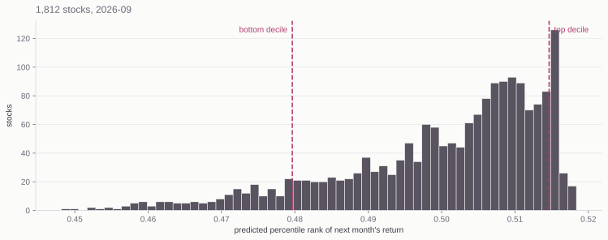

# Train and Test


## Fifteen Features: 6 Price and Volume {.plain-title}

| | |
|---|---|
| `momentum` | 11-month return, skipping the most recent month |
| `ret_1m` | last month's return |
| `volatility` | volatility of daily returns within the month |
| `volatility_12m` | volatility of the last 12 monthly returns |
| `illiquidity` | Amihud: average absolute return per dollar traded |
| `dollarvol` | average daily dollar volume |

::: {.note}
Momentum skips month *t*--1 because stocks tend to reverse at a one-month
horizon. That month is carried separately as `ret_1m`.
:::

## Fifteen Features: 9 Valuation and Accounting {.plain-title}

| | |
|---|---|
| `marketcap` | market capitalization |
| `pb` | price to book |
| `ps` | price to sales |
| `roe` | return on equity |
| `grossprofitability` | gross profit over assets |
| `accruals` | the part of earnings not backed by cash flow |
| `assetgrowth` | change in assets since the last annual filing |
| `issuance` | log change in shares outstanding |
| `divyield` | dividend yield |


## How the Model Was Fit {.band-bottom}

::: {.steps}
1. Use 2001-01 through 2020-12 as the training period.
2. Filter to approximate Russell 2000 universe - market cap between 1,001 and 3000, inclusive, at the beginning of each month.
3. Replace every feature with its rank (0 to 1) inside that month's Russell 2000 universe.
4. Choose the hyperparameters on expanding-window folds: train on the earliest
   months, validate on the block that follows.
5. Refit on the whole training period with the chosen settings and save the
   model to a file: `session7_model.joblib`. 
:::

::: {.note}
Industry is not a feature: an earlier fit with sector dummies picked up the
sector returns of the training years.
:::

## Target and Scoring

- Try to predict how each stock's return will rank in the Russell 2000 universe, from 0 to 1.
- Not trying to predict whether stocks are up or down in aggregate --- no market timing.
- Just trying to predict which stocks will beat others.
- For evaluating hyperparameters, rank predictions 0 to 1 and compute correlation with actual ranks.  Higher ecorrelation is better.

## Expanding-Window Folds {.plain-title}

::: {.lead}
The 240 training months are cut into six blocks of 40. Each fold trains on the
blocks before it and is scored on the one that follows.
:::

```
block      1      2      3      4      5      6
fold 1   train  valid
fold 2   train  train  valid
fold 3   train  train  train  valid
fold 4   train  train  train  train  valid
fold 5   train  train  train  train  train  valid
```

::: {.note}
Six blocks give five folds. The folds are whole months and always run forward
--- shuffling the rows would train the model on 2018 to predict 2006.
:::

## Test Procdure {.plain-title}

- `session7_test.parquet` contains the 15 features ranked within each cross section 2001-01 through 2026-09
- Applying `session7_model.joblib` to each cross-section gives predictions (of ranks)
- Assignment was to form portfolios based on the predictions and to evaluate the results


# Build an App

## Refit on All Past Data {.plain-title}

- The expanding-window cross-validation was repeated on the full dataset 2001-01 through 2026-09
- Using the best hyperparameters, the model was refit on the full dataset: `session7_model_full.joblib`

## Use the Model to Make Predictions 

- Our goal is to use it to make stock predictions for the upcoming month (21 trading days)
- We should update our features daily based on prices and volumes and any new 10-K's
- Instead we are going to use data frozen last week: `session7_live.parquet`


# How Software Works

## Frontend and Backend

:::: {.columns}
::: {.column width="50%"}
[Frontend]{.eyebrow}

The browser. HTML, CSS, and JavaScript --- it draws the page and collects the
clicks.
:::

::: {.column width="50%"}
[Backend]{.eyebrow}

A program on a server that listens continuously for requests. Yours will be
Python.
:::
::::

::: {.lead}
You open a URL. The browser sends a GET request. The server sends back the
HTML, CSS, and JavaScript it was written to send. The browser interprets that
and shows you a page.
:::

::: {.note}
Right-click any web page and choose View Page Source. That is the frontend
code, exactly as the backend handed it over.
:::

## Then You Click Something {.plain-title}

::: {.lead}
A POST request carries data the other way --- a form, a ticker you typed. The
server does what it was written to do and replies.
:::

{.nostretch width="90%" fig-align="center"}

## Running Locally {.band-bottom}

::: {.lead}
The backend and the frontend can be the same computer --- lab638, or your own
laptop if you have Python installed on it.
:::

::: {.cards .cards-2}
::: {.card}
[localhost]{.card-title}

`127.0.0.1` is the loopback address. The browser asks the machine it is already
running on, and the request never reaches a network.
:::

::: {.card .card-blue}
[Ports]{.card-title}

One machine can run many programs listening at once. The port number tells the
operating system which of them gets the request.
:::
:::

::: {.note .note-plum}
You write the app as a `.py` file. FastAPI is the dominant Python library for
writing one; `uvicorn` runs it and starts it listening on a port:
`python3 -m uvicorn app:app --reload`.
:::


## Basic Design

::: {.steps}
1.  The fitted gradient boosting model `session7_model_full.joblib` is baked into the app (rebuild the app when the model is refitted)
2.  Overnight, all new data should be pulled, ranks computed, the model run, and predictions made
3.  The predictions should be mapped into whatever output you want the app to have (Buy, Sell, etc.)
4.  User inputs a ticker and gets the output 
5.  We're going to skip the overnight pulling and bake `session7_live.parquet` into the app 
:::

## First, What do the Predictions Look Like? {.plain-title}

{.nostretch width="100%"}

Every prediction sits between 0.448 and 0.518. Adjacent decile cutoffs in the
middle are four thousandths apart.

## What the App Should Produce {.band-bottom}

- First, where does a stock fit within the predictions?  Top decile?  Middle quintile? ...
- Where does it fit within its sector or industry?
- Within a marketcap band?  (But only small caps here).

::: {.note}
Argue these out with AI before you ask it to write code.
:::

# Deploying an App

## Platform as a Service

::: {.lead}
You hand a host your repository. It builds the app, runs it, and puts it behind
a public URL --- there is no server for you to administer. Railway, Render,
Koyeb, and Heroku all do this. We will use Koyeb, which has a free tier.
:::

::: {.steps}
1. Create a free account at `koyeb.com`.
2. In the control panel, create an API access token. Koyeb shows it once, so copy it then.
3. In a terminal, add it to your `.env` file:
:::

```bash
printf '\nKOYEB_ACCESS_TOKEN=your_access_token\n' >> $HOME/.env
```

::: {.note}
`>>` appends, and creates the file if you do not have one. Koyeb's web UI will
link a GitHub repo with no token at all --- the token is what lets AI do the
deploying for you, which is the path we are taking.
:::

## Deploy the App {.plain-title}

::: {.prompt-box}
::: {.box-title}
Prompt
:::
My goal is to push this app to GitHub as a new public repo and then create a
Koyeb service connected to that repo. Walk me through it one step at a time.
:::

::: {.note .note-plum}
On day one you told git to ignore parquet files. The host builds only what is in
the repo, so the model file and the data the app reads have to get there. And
nothing from `.env` belongs in a public repo --- secrets go in Koyeb's
environment settings.
:::

## Get a Custom Domain

::: {.lead}
Optional. The Koyeb URL works fine on its own.
:::

::: {.steps}
1. Create an account at `dnsimple.com` and buy a domain name.
2. In your DNSimple account settings, create an API access token and add it to `.env`:
:::

```bash
printf '\nDNSIMPLE_ACCESS_TOKEN=your_access_token\n' >> $HOME/.env
```

::: {.prompt-box}
::: {.box-title}
Prompt
:::
I bought mydomain.com at DNSimple and my app is running on Koyeb. Use the
DNSimple API v2 with DNSIMPLE_ACCESS_TOKEN to create the record Koyeb needs, and
tell me what to configure on the Koyeb side.
:::
