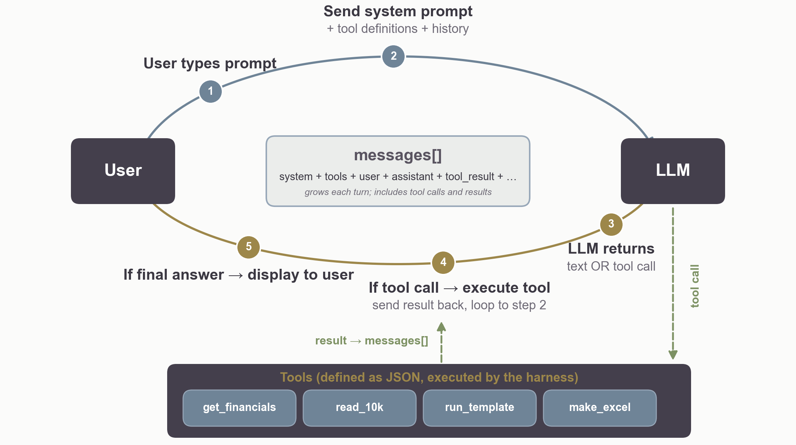
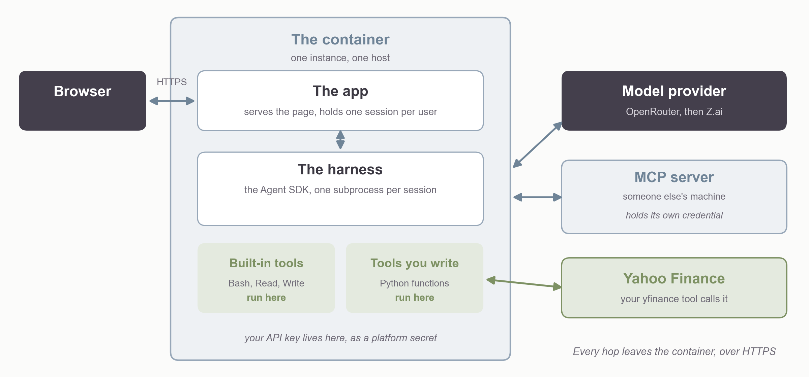

## Overview {.plain-title}

::: {.steps}
1. Build a template for two-stage DCF
2. But firm valuation is not "one size fits all," so a  spreadsheet template or a classical app is limited
3. Create an agent skill 
4. Create a stand-alone agent

:::

## Template {.plain-title}

| Input | Basis |
|---|---|
| Sales growth | |
| EBITDA margin | |
| Depreciation | % of prior year net PP&E |
| Cash tax rate | cash taxes / pretax income |
| Sales-to-NWC ratio | prior or average or ending NWC? |
| Sales-to-net PP&E ratio | prior or average net PP&E? |
| Cap ex | a plug |

::: {.note}
Cash taxes: the provision less its deferred portion, or the taxes paid per the
cash flow statement.
:::

## Issues (There Are Many) {.plain-title}

:::: {.columns}
::: {.column width="50%"}
- Value real estate, reserves, ...
- Leases: financial or operating?
- Minority interests, investments in and income from affiliates
- Goodwill: constant or growing?
:::

::: {.column width="50%"}
- Long-term deferred taxes: debt or equity?
- Other long-term assets and liabilities
- Derivative positions
- Preferred stock, convertible bonds, ...
:::
::::

## Skills {.plain-title}

::: {.lead}
A folder with a `SKILL.md` in it --- written instructions, plus any scripts and
examples they refer to.
:::

```
.claude/skills/dcf/
├── SKILL.md       a description, then the instructions
├── references/    the template, the issues
└── scripts/       code the agent can run
```

::: {.note}
At startup Claude reads each skill's description.
When a task matches a skill, Claude reads that whole `SKILL.md` and follows it.
:::

## The Same File in Other Agents {.plain-title}

::: {.lead}
Anthropic wrote the format and released it as an open standard. The others
adopted it rather than inventing their own.
:::

| Agent | Where it looks |
|---|---|
| Claude Code | `.claude/skills/` |
| Codex and ChatGPT | `.agents/skills/` |
| Gemini CLI | `.gemini/skills/`, or `.agents/skills/` |

::: {.note}
Same file, same description-first loading. Put the folder in `.agents/skills/`
and both Codex and Gemini CLI find it.
:::

## Creating a Skill {.plain-title}

- Work with AI until you get what you want
- Tell AI to create a skill so you can get the same thing the next time 
- Give the skill a meaningful name.
- As you use it and find things to add or modify, tell AI to edit the skill.

## What Goes in the DCF Skill {.plain-title}

::: {.lead}
The template lives here.
:::

- Instructions for getting data, possibly including MD&A, risks from 10-K, earnings calls, news
- Instructions to use xlsx and pptx skills, any special formatting you want
- Guidelines for walking through other issues

## Creating an Agent {.plain-title}

::: {.steps}
1. Stand-alone app
2. API calls to large language model
3. Could use Claude Agent SDK, though Claude can also write everything from scratch 
:::

::: {.note}
The same `SKILL.md` works in Claude Code and inside the agent app. 
:::


## Inside an Agent {.plain-title}

{.nostretch width="84%" fig-align="center"}

# Claude Agent SDK

## Three Varieties of Tools {.plain-title}

::: {.cards .cards-3}
::: {.card}
[Claude Code tools]{.card-title}

The inherited built-ins --- Read, Write, Edit, Bash, Grep, Glob, WebSearch,
WebFetch, ...
:::

::: {.card .card-blue}
[Internal MCP tools]{.card-title}

Your own Python functions --- `run_python`, or the valuation itself.
:::

::: {.card}
[External MCP tools]{.card-title}

Connectors --- databases, the web, your inbox.
:::
:::

::: {.note .note-plum}
The LLM never runs anything. The harness --- everything in an agent that is not
the model --- executes the tool the model asks for, or refuses.
:::

## Where They Run {.plain-title}

| | |
|---|---|
| Read, Write, Edit, Bash, Grep | the agent's own process --- its filesystem, its shell, its network |
| Internal MCP tools | the same process --- whatever it can import, it can run |
| External MCP tools | someone else's server --- arguments out over HTTP, only the result back |
| `WebSearch` | Anthropic's search backend --- titles and URLs, not pages |
| `WebFetch` | downloads from your machine, then a small model extracts what was asked |

::: {.note}
So "on your machine" holds for the filesystem and shell tools. The two web
tools are not local: the search runs at Anthropic, and the fetched page is sent
there to be read.
:::

## The Deployed Agent {.plain-title}

{.nostretch width="88%" fig-align="center"}

## Agent Options {.plain-title}

| `ClaudeAgentOptions` | |
|---|---|
| `system_prompt` | a string, or a file on disk when it is long |
| `tools` | which built-ins to include --- `tools=[]` for none |
| `disallowed_tools` | takes a tool out of the model's context entirely |
| `allowed_tools` | the tools that run without prompting |
| `mcp_servers` | the servers to connect, plus the one holding your tools |
| `max_turns` | how many tool-use round trips before the app stops it |

::: {.note}
`allowed_tools` is not a whitelist. A tool left off it still runs --- it falls
through to `permission_mode`.
:::

## Permission Modes {.plain-title}

| `permission_mode` | |
|---|---|
| `default` | prompts before file edits, shell commands, and network requests |
| `acceptEdits` | auto-approves edits and common filesystem commands |
| `plan` | read-only --- proposes changes but makes none |
| `dontAsk` | only `allowed_tools` run; anything else is denied, not prompted |
| `bypassPermissions` | everything runs, no checks --- sandboxed containers only |

## Custom Tools {.plain-title}

A Python function with a decorator giving its name, description, and arguments.

```python
@tool(
    "get_financials",
    "Fetch a company's income statement, balance sheet and cash flow.",
    {"ticker": Annotated[str, "The stock's ticker symbol"]},
)
async def get_financials(args):
    t = yf.Ticker(args["ticker"])
    csv = t.income_stmt.to_csv()
    return {"content": [{"type": "text", "text": csv}]}
local_server = create_sdk_mcp_server(name="local", tools=[get_financials])
```

::: {.note .note-plum}
Tools fetch. The skill specifies the workbook, and the workbook's own formulas
do the arithmetic --- so the valuation is not a tool.
:::

## Producing the Output {.plain-title}

::: {.cards .cards-2}
::: {.card}
[The workbook]{.card-title}

The `xlsx` skill --- pandas and openpyxl, plus a financial-modeling standard
for formatting and formula conventions.
:::

::: {.card .card-blue}
[The deck]{.card-title}

The `pptx` skill --- `markitdown` and the pack scripts to edit a template,
`pptxgenjs` under Node to build one from scratch.
:::
:::

::: {.note .note-plum}
The xlsx skill's rule: formulas in the cells, not values computed in Python.
`=SUM(B2:B9)`, never the number Python got --- so changing an assumption
recalculates the workbook.
:::

::: {.note}
Skills are files in `.claude/skills/`, loaded when relevant. The container
image has to carry what they import.
:::
