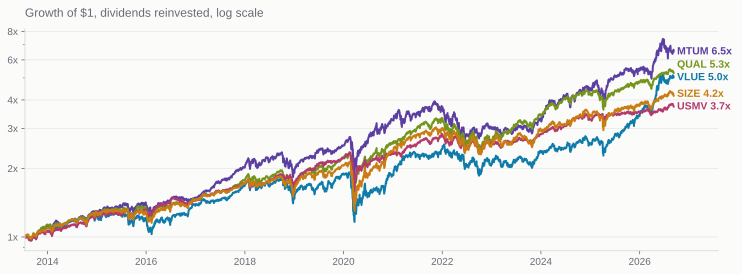
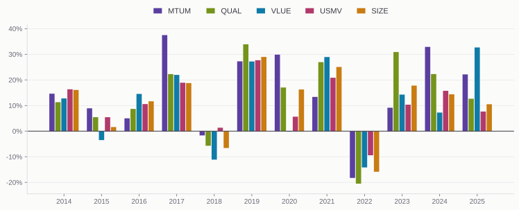

## Today

::: {.steps}
1. Five iShares funds and the factor each one buys
2. The index methodology is the strategy, published in full
3. Where the published rules run out
4. Positions disclosed every morning, and why the law requires it
5. What the five actually earned
:::

# The Funds

## Five single-factor funds

| Ticker | Factor | Index | First trade |
|---|---|---|---|
| MTUM | Momentum | MSCI USA Momentum SR Variant | 2013-04-18 |
| QUAL | Quality | MSCI USA Sector Neutral Quality | 2013-07-18 |
| VLUE | Value | MSCI USA Enhanced Value | 2013-04-18 |
| USMV | Minimum volatility | MSCI USA Minimum Volatility | 2011-10-20 |
| SIZE | Small size | MSCI USA Low Size | 2013-04-18 |

::: {.note}
None of these is an active fund. Each one tracks an index, and the index
provider publishes the construction rules.
:::

## Who actually writes the strategy {.band-bottom}

::: {.lead}
BlackRock runs the fund. MSCI defines what it holds.
:::

The prospectus tells you the fund tracks the MSCI USA Momentum SR Variant
Index. It does not tell you what momentum means. That definition lives in
MSCI's methodology document — a free PDF, thirty-odd pages, with the formulas
in it.

So the question "do they publish the strategy" has a better answer than most
people expect: for these five, largely yes.

# The Rules

## Momentum, spelled out

MSCI builds a momentum score for every stock in the parent index:

::: {.steps}
1. Price return over the trailing 6 months and 12 months, each in excess of the risk-free rate
2. Divide each by the annualized standard deviation of weekly returns over three years
3. Standardize both into z-scores and average them
4. Winsorize at plus or minus three standard deviations
5. Weight by market cap times the momentum score
:::

Rebalanced semiannually in May and November, with a conditional extra
rebalance when market volatility spikes.

## Quality and value {.plain-title}

:::: {.columns}
::: {.column width="50%"}
### QUAL

Three inputs, equally weighted:

- Return on equity
- Debt to equity
- Earnings variability

Scored within sector, then held sector-neutral against the parent index.
:::

::: {.column width="50%"}
### VLUE

Three inputs:

- Forward price-to-earnings
- Price-to-book
- Enterprise value to operating cash flow

Scored relative to sector peers, so it does not simply become an
energy-and-banks fund.
:::
::::

## Why sector neutrality is in there

::: {.lead}
A naive value screen is mostly a bet on which industries are cheap.
:::

Banks trade at low price-to-book because they are banks. Software trades high
because it is software. Rank the whole market on price-to-book and you have
built a sector rotation fund wearing a value label.

Scoring within sector strips that out, so what is left is the cheap bank
against the expensive bank.

## Where the published rules stop {.band-bottom}

USMV is the honest exception. Its methodology states the problem exactly:
minimize predicted portfolio variance subject to sector weights within five
percent of the parent, single-name caps, and a turnover limit.

Every constraint is public. The covariance matrix is not — it comes from
Barra's equity risk model, which is proprietary.

::: {.note .note-plum}
You can write down USMV's optimization problem precisely and still not
reproduce its holdings. The objective function is a black box.
:::

# The Positions

## Published every morning

::: {.lead}
SEC Rule 6c-11, adopted in 2019, is why.
:::

An ETF relying on the rule must post on its website, before the market opens
each business day, the complete portfolio holdings that form the basis of that
day's net asset value calculation.

Not a summary. Not the top ten. Every position, with quantity, market value,
and percent weight.

## What that gets you {.plain-title}

::: {.cards .cards-3}
::: {.card}
[Full holdings]{.card-title}

Name, ticker, CUSIP, shares, market value, weight. A CSV on the sponsor's site.
:::

::: {.card .card-blue}
[Every business day]{.card-title}

Yesterday's closing portfolio, posted this morning. Effectively T-1, not
intraday.
:::

::: {.card}
[No archive]{.card-title}

The file is overwritten each morning. Sponsors keep no history — if you want a
time series, start saving today.
:::
:::

## How this differs from a mutual fund

An ordinary mutual fund discloses holdings on Form N-PORT: quarter-end
positions, public sixty days later.

::: {.stats}
::: {.stat}
[1 day]{.stat-value}
[ETF disclosure lag under Rule 6c-11]{.stat-label}
:::
::: {.stat}
[~150 days]{.stat-value}
[worst-case mutual fund lag]{.stat-label}
:::
:::

That gap is a design choice. Daily disclosure is what lets authorized
participants price the creation basket, which is what keeps the ETF trading
near NAV.

## The funds that opted out

A small group of active ETFs — Precidian's ActiveShares, and structures from
T. Rowe Price and Fidelity — obtained separate exemptive orders rather than
relying on 6c-11.

They publish a proxy basket daily and real holdings quarterly.

::: {.note}
The reason is exactly what you would guess. A manager whose edge is the trade
itself does not want the trade printed at 9am.
:::

# The Returns

## Growth of a dollar {.plain-title}

{.nostretch width="100%"}

Common window since QUAL's launch. Yahoo Finance adjusted closes.

## Risk and return {.band-bottom}

| Fund | CAGR | Volatility | Worst drawdown | Return / vol |
|---|---|---|---|---|
| MTUM | 15.4% | 20.3% | −34.1% | 0.76 |
| QUAL | 13.5% | 17.1% | −34.1% | 0.79 |
| VLUE | 13.1% | 18.8% | −39.5% | 0.70 |
| USMV | 10.6% | 13.7% | −33.1% | 0.77 |
| SIZE | 11.5% | 17.4% | −39.2% | 0.66 |

Momentum won on raw return. Adjust for volatility and the five funds are
separated by very little.

## Nobody wins twice running {.plain-title}

{.nostretch width="100%"}

## Twelve years, four winners

::: {.stats}
::: {.stat}
[4]{.stat-value}
[calendar years won by MTUM]{.stat-label}
:::
::: {.stat}
[3]{.stat-value}
[won by USMV, and 3 by VLUE]{.stat-label}
:::
::: {.stat}
[0]{.stat-value}
[won by SIZE]{.stat-label}
:::
:::

No fund won two years in a row. USMV's wins include 2018 and 2022, the only two
losing years in the sample — it did not outperform so much as fall less, which
is the whole design.

SIZE never finished first, and still returned 11.5% a year.

## What the table does not say {.band-bottom}

Thirteen years is one sample. Five funds that all hold large US stocks are
five correlated draws from it, not five independent tests.

The spread between best and worst here is about five points of annual return —
real money, and also well inside what thirteen years of noise can produce.

# Doing It Yourself

## The replication exercise

::: {.steps}
1. Pull the MSCI methodology for MTUM, QUAL or VLUE
2. Build the score from Sharadar fundamentals and prices
3. Form the portfolio at the last May or November rebalance
4. Download today's holdings CSV from the iShares site
5. Compare your weights to theirs, name by name
:::

Try USMV the same way and you will get stuck, which is the point of having
tried it.

## Where the data comes from

- Prices for the five funds: Yahoo Finance, since `sep` in our database holds
  common stock only
- Fundamentals for building the scores: `sf1`
- Holdings: the sponsor's own CSV, or SEC Form N-PORT for the quarter-end
  snapshot

::: {.note .note-plum}
Save the holdings file the day you download it. Nobody sells you yesterday's.
:::

# Exercise

## Hands On

Do the five funds earn anything the market did not already pay for?

::: {.steps}
1. Pull daily adjusted closes for MTUM, QUAL, VLUE, USMV, SIZE and SPY from Yahoo Finance
2. Pull the risk-free rate from Ken French's data library
3. Subtract the risk-free rate from every return to get excess returns
4. Regress each fund's excess return on SPY's excess return
5. Report the intercept, annualized, with its $t$-statistic
:::

::: {.note .note-plum}
Tell AI to do it. `yfinance` reads Yahoo, and
`pandas_datareader.famafrench` reads French. You do not have to know either
one to ask for the regression.
:::

## Where This Goes Wrong {.band-bottom}

::: {.cards .cards-2}
::: {.card}
[French is in percent]{.card-title}

The file gives `0.02`, meaning two hundredths of a percent. Divide by 100
before subtracting it from a return.
:::

::: {.card .card-blue}
[The daily rate is daily]{.card-title}

French's daily `RF` is already a one-day return. Do not divide it by 252.
:::

::: {.card}
[The calendars differ]{.card-title}

French posts a month or two behind Yahoo. Your excess returns end where the
risk-free rate ends, not where the prices do.
:::

::: {.card .card-blue}
[The window starts late]{.card-title}

QUAL is the youngest of the five. A common sample begins in July 2013, not
whenever each fund launched.
:::
:::

## What to Report

One row per fund:

| Column | What it is |
|---|---|
| $\alpha$ | Intercept $\times$ 252, or $\times$ 12 if you work monthly |
| $t(\alpha)$ | Is it distinguishable from zero? |
| $\beta$ | Market exposure, and whether it is really 1 |
| Tracking error | Standard deviation of the residual, annualized |

Then say, in one sentence, whether any of the five beat SPY.

::: {.note}
Daily or monthly is your choice. Do it both ways if you have time, and see how
little the answer moves.
:::

## Questions to Argue About {.band-bottom}

::: {.steps}
1. Four of the five alphas come out negative. Does that mean the factors failed?
2. USMV's $\beta$ is about 0.7. Is its low return a disappointment or an arithmetic consequence?
3. With a tracking error near 9%, how many years would it take to detect a 2% alpha?
4. All five funds hold large US stocks. How many independent tests did you just run?
:::

## What You Should Find {.plain-title}

Monthly excess returns, July 2013 through July 2026, regressed on SPY:

| Fund | Alpha / yr | t-stat | Beta | Tracking error |
|---|---|---|---|---|
| MTUM | +1.7% | 0.71 | 0.99 | 8.8% |
| QUAL | −0.2% | −0.28 | 0.99 | 2.9% |
| VLUE | −1.5% | −0.63 | 1.08 | 8.6% |
| USMV | +0.3% | 0.19 | 0.70 | 5.7% |
| SIZE | −2.2% | −1.50 | 1.01 | 5.0% |

Not one $t$-statistic is near 2. A joint test of all five gives $p = 0.66$.

::: {.note .note-plum}
Thirteen years cannot tell a 2% alpha from zero when the tracking error is
four times as large.
:::
