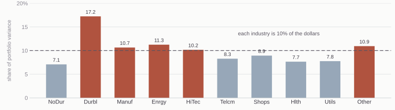
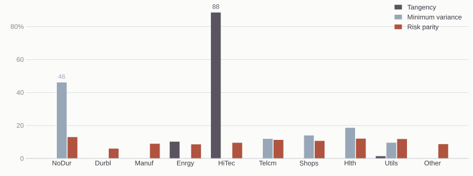
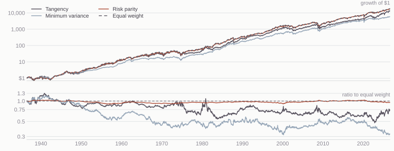

## Install two plugins

```
/plugin marketplace add kerryback/skills
/plugin install risk-parity@kerryback
/plugin install two-stage-dcf@kerryback
```

::: {.note .note-plum}
Now ask Claude what it installed.
:::

## Today

::: {.steps}
1. Three rules for choosing portfolio weights, and what each one needs
2. Tangency and minimum variance
3. Risk parity: each asset's share of portfolio variance
4. All three on ten industry portfolios, weekly returns, the past ten years
5. Solving for the risk parity weights, and turning that into a skill
6. A ninety-year backtest: rolling ten-year windows, rebalanced monthly
:::

## The three rules {.band-bottom}

::: {.cards .cards-3}
::: {.card}
[Tangency]{.card-title}

Maximizes the Sharpe ratio.

Inputs: expected returns, the covariance matrix, and the risk-free rate.
:::

::: {.card .card-blue}
[Minimum variance]{.card-title}

Minimizes portfolio variance.

Inputs: the covariance matrix.
:::

::: {.card}
[Risk parity]{.card-title}

Equalizes each asset's share of portfolio variance.

Inputs: the covariance matrix.
:::
:::

All three are long only here: no short sales, and the weights sum to one.

## Tangency and minimum variance {.compare}

:::: {.columns}
::: {.column width="50%"}
### Tangency

The highest Sharpe ratio available from the ten industries.

Needs an expected return for every industry.
:::

::: {.column width="50%"}
### Minimum variance

The smallest variance available from the ten industries.

Needs only the covariance matrix.
:::
::::

::: {.note}
Tangency is the only one of the three rules that uses expected returns. Long
only, none of the three has a closed-form solution, so all three are solved
numerically.
:::

# Risk Parity

## What minimum variance leaves out

Minimum variance uses no expected returns at all. It is the portfolio you would
hold if you believed every industry had the same expected return.

It puts the most weight wherever the sample says risk is lowest, so an industry
whose risk the sample underestimates is rewarded with a large weight for that
reason.

::: {.note}
Long only on these ten industries, it holds five of them, with 46% in consumer
nondurables.
:::

## Two rules from the covariance matrix {.compare .band-bottom}

:::: {.columns}
::: {.column width="50%"}
### Minimum variance

Makes the portfolio's variance as small as it can be.

Concentrates on the quietest assets.
:::

::: {.column width="50%"}
### Risk parity

Makes every asset's contribution to that variance the same.

Holds everything on the menu.
:::
::::

Neither uses expected returns. With two assets, equal contributions mean weights
proportional to one over volatility, whatever the correlation.

## Nondurables, energy, technology {.plain-title}

```{=html}
<div class="twoasset">
  <div class="ta-controls">
    <label>NoDur
      <input type="range" id="ta-m1" min="0" max="30" step="0.1" value="6.8">
      <output id="ta-o1">6.8%</output></label>
    <label>Enrgy
      <input type="range" id="ta-m2" min="0" max="30" step="0.1" value="14.7">
      <output id="ta-o2">14.7%</output></label>
    <label>HiTec
      <input type="range" id="ta-m3" min="0" max="30" step="0.1" value="23.0">
      <output id="ta-o3">23.0%</output></label>
  </div>
  <div class="ta-params">
    <span class="ta-plab">standard deviation</span>
    <span>NoDur 15.2%</span><span>Enrgy 30.0%</span><span>HiTec 21.8%</span>
  </div>
  <div class="ta-params">
    <span class="ta-plab">correlation</span>
    <span>NoDur&ndash;Enrgy 0.45</span><span>NoDur&ndash;HiTec 0.51</span><span>Enrgy&ndash;HiTec 0.29</span>
  </div>
  <div id="ta-plot"></div>
</div>

<style>
.reveal .twoasset { margin-top:0.2em; }
.reveal .ta-controls { display:flex; align-items:center; gap:1.5em; margin-bottom:0.1em; }
.reveal .ta-controls label { color:#8a8792; font-size:0.78em; letter-spacing:0.04em;
  display:flex; align-items:center; gap:0.5em; white-space:nowrap; }
.reveal .ta-controls input[type=range] { width:7em; accent-color:#595460; cursor:pointer; }
.reveal .ta-controls output { color:#3b3842; font-size:1.05em; width:3.1em;
  font-variant-numeric:tabular-nums; }
.reveal .ta-params { display:flex; align-items:baseline; gap:1.6em;
  color:#8a8792; font-size:0.70em; letter-spacing:0.03em; line-height:1.55; }
.reveal .ta-plab { color:#97A7B8; letter-spacing:0.12em; text-transform:uppercase;
  width:11.6em; flex:none; white-space:nowrap; }
.reveal .ta-params span:not(.ta-plab) { width:9.6em; flex:none;
  font-variant-numeric:tabular-nums; }
.reveal #ta-plot { height:272px; }
</style>

<script src="https://cdn.plot.ly/plotly-2.35.2.min.js" charset="utf-8"></script>
<script>
(function () {
  var NAMES = ["NoDur", "Enrgy", "HiTec"];
  var SIG = [[231.7501, 207.7179, 168.0876],
             [207.7179, 900.2716, 190.8310],
             [168.0876, 190.8310, 475.2562]];
  var VOL = [15.223, 30.005, 21.800];
  var WG = [0.8086, 0.0225, 0.1688], WR = [0.4336, 0.2411, 0.3254];
  var PLUM = "#595460", BLUE = "#97A7B8", RUST = "#b0533f",
      INK = "#3b3842", MUTED = "#8a8792", GRID = "#cfd3d6", PANEL = "#fbfbfa";
  var FONT = "Meiryo, 'Helvetica Neue', Arial, sans-serif";
  var STEP = 0.004, NB = 260, SKIP = 12;
  var g1, g2, gv, N, plot, sl = [], op = [];

  function pvol(w) {
    var v = 0, i, j;
    for (i = 0; i < 3; i++) for (j = 0; j < 3; j++) v += w[i]*w[j]*SIG[i][j];
    return Math.sqrt(v);
  }
  function dot(w, m) { return w[0]*m[0] + w[1]*m[1] + w[2]*m[2]; }
  function wtxt(a, b) {
    return NAMES[0] + " " + Math.round(100*a) + "%<br>" + NAMES[1] + " " +
           Math.round(100*b) + "%<br>" + NAMES[2] + " " + Math.round(100*(1-a-b)) + "%";
  }

  function buildGrid() {
    var n = Math.round(1/STEP), k = 0, i, j;
    N = (n+1)*(n+2)/2;
    g1 = new Float64Array(N); g2 = new Float64Array(N); gv = new Float64Array(N);
    for (i = 0; i <= n; i++) for (j = 0; j <= n-i; j++) {
      var a = i*STEP, b = j*STEP;
      g1[k] = a; g2[k] = b; gv[k] = pvol([a, b, 1-a-b]); k++;
    }
  }

  function envelope(m) {
    var lo = Math.min(m[0], m[1], m[2]), hi = Math.max(m[0], m[1], m[2]);
    var span = (hi - lo) || 1, best = new Int32Array(NB).fill(-1), i, b, r;
    for (i = 0; i < N; i++) {
      r = g1[i]*m[0] + g2[i]*m[1] + (1-g1[i]-g2[i])*m[2];
      b = Math.min(NB-1, Math.max(0, Math.floor((r-lo)/span*NB)));
      if (best[b] < 0 || gv[i] < gv[best[b]]) best[b] = i;
    }
    var out = [];
    for (b = 0; b < NB; b++) if (best[b] >= 0) {
      i = best[b];
      out.push({ v: gv[i], r: g1[i]*m[0] + g2[i]*m[1] + (1-g1[i]-g2[i])*m[2],
                 t: wtxt(g1[i], g2[i]) });
    }
    out.sort(function (p, q) { return p.r - q.r; });
    return out;
  }

  function interp(env, r) {
    for (var i = 1; i < env.length; i++)
      if (env[i].r >= r) {
        var a = env[i-1], b = env[i], f = (r - a.r) / ((b.r - a.r) || 1);
        return a.v + f*(b.v - a.v);
      }
    return env[env.length-1].v;
  }

  function draw() {
    if (!window.Plotly || !plot) return;
    var m = sl.map(function (s, i) { op[i].textContent = (+s.value).toFixed(1) + "%"; return +s.value; });
    var env = envelope(m);
    var gmvV = pvol(WG), gmvR = dot(WG, m), rpV = pvol(WR), rpR = dot(WR, m);
    var eff = env.filter(function (p) { return p.r >= gmvR; }),
        ine = env.filter(function (p) { return p.r <= gmvR; });

    function line(a, color, dash) {
      return { x: a.map(function (p) { return p.v; }), y: a.map(function (p) { return p.r; }),
               text: a.map(function (p) { return p.t; }), mode: "lines",
               line: { color: color, width: 2.4, dash: dash },
               hovertemplate: "%{text}<extra></extra>", showlegend: false };
    }
    var cloud = { x: [], y: [], text: [], mode: "markers",
                  marker: { color: "#dedfda", size: 3 },
                  hovertemplate: "%{text}<extra></extra>", showlegend: false };
    for (var i = 0; i < N; i += SKIP) {
      cloud.x.push(gv[i]);
      cloud.y.push(g1[i]*m[0] + g2[i]*m[1] + (1-g1[i]-g2[i])*m[2]);
      cloud.text.push(wtxt(g1[i], g2[i]));
    }
    var corners = { x: VOL, y: m, text: NAMES, mode: "markers+text",
                    textposition: ["middle left", "middle right", "middle right"],
                    textfont: { color: MUTED, size: 12.5, family: FONT },
                    marker: { color: MUTED, size: 7 },
                    hoverinfo: "skip", showlegend: false };
    function pt(w, v, r, color, label, pos) {
      return { x: [v], y: [r], mode: "markers+text", text: [label], textposition: pos,
               textfont: { color: color, size: 15, family: FONT },
               marker: { color: color, size: 13, line: { color: PANEL, width: 2 } },
               customdata: [wtxt(w[0], w[1])],
               hovertemplate: "%{customdata}<extra></extra>", showlegend: false };
    }
    var fv = interp(env, rpR);
    var gap = { x: [fv, rpV], y: [rpR, rpR], mode: "lines",
                line: { color: RUST, width: 1.7, dash: "dot" },
                hoverinfo: "skip", showlegend: false };

    var data = [cloud, line(ine, MUTED, "dot"), line(eff, PLUM, "solid"), gap, corners,
                pt(WG, gmvV, gmvR, BLUE, " Minimum variance", "middle right"),
                pt(WR, rpV, rpR, RUST, " Risk parity", "middle right")];
    var lo = Math.min.apply(null, m), hi = Math.max.apply(null, m),
        pad = Math.max(1.8, 0.16*(hi-lo));
    Plotly.react(plot, data, {
      margin: { l: 58, r: 18, t: 10, b: 44 },
      paper_bgcolor: PANEL, plot_bgcolor: PANEL,
      font: { family: FONT, size: 13, color: INK },
      xaxis: { title: { text: "volatility", font: { size: 13, color: MUTED } },
               range: [13.4, 31.0], ticksuffix: "%", gridcolor: GRID, zeroline: false,
               tickfont: { color: MUTED }, linecolor: GRID },
      yaxis: { title: { text: "expected return", font: { size: 13, color: MUTED } },
               range: [lo - pad, hi + pad], ticksuffix: "%", gridcolor: GRID,
               zeroline: false, tickfont: { color: MUTED }, linecolor: GRID },
      hoverlabel: { bgcolor: PANEL, bordercolor: GRID,
                    font: { family: FONT, size: 14, color: INK } },
      showlegend: false
    }, { displayModeBar: false, responsive: true });
  }

  function init() {
    plot = document.getElementById("ta-plot");
    sl = [1,2,3].map(function (k) { return document.getElementById("ta-m" + k); });
    op = [1,2,3].map(function (k) { return document.getElementById("ta-o" + k); });
    if (!plot || !sl[0]) return;
    if (!window.Plotly) { return void setTimeout(init, 200); }
    buildGrid();
    sl.forEach(function (s) { s.addEventListener("input", draw); });
    if (window.Reveal) Reveal.on("slidechanged", function () { Plotly.Plots.resize(plot); });
    draw();
  }
  if (document.readyState === "loading")
    document.addEventListener("DOMContentLoaded", init);
  else init();
})();
</script>
```

Ten years of weekly returns. Both portfolios keep their weights whatever you
choose; risk parity sits inside the frontier.

## Risk shares under equal weights {.plain-title}

{.nostretch width="100%"}

Ten industries, equally weighted. Consumer durables have an annualized
volatility of 39%, consumer nondurables 15%.

## Share of portfolio variance

Take an asset's weight in the portfolio, multiply by the covariance of that
asset with the return of the portfolio, and divide by the variance of the
portfolio. That is the asset's share of portfolio variance.

Those weighted covariances add up to the portfolio variance, so the shares sum
to one.

::: {.note .note-plum}
Risk parity sets every share equal: one tenth each, across ten industries.
:::

# Ten Industries

## The data {.band-bottom}

::: {.steps}
1. Ken French's 10 Industry Portfolios, value weighted, daily
2. Compounded to weeks ending Friday: 522 weeks, 9 September 2016 to 4 September 2026
3. Expected returns and the covariance matrix are the sample mean and covariance over those weeks, annualized by 52
4. The risk-free rate is French's daily rate compounded the same way, 2.4% a year
:::

NoDur, Durbl, Manuf, Enrgy, HiTec, Telcm, Shops, Hlth, Utils, Other.

## The three portfolios {.plain-title}

{.nostretch width="100%"}

Weights from the full 522 weeks, long only.

## What each rule holds {.plain-title}

| Rule | Industries held | Largest position | Largest share of variance |
|---|---|---|---|
| Tangency | 3 | HiTec, 88% | HiTec, 93% |
| Minimum variance | 5 | NoDur, 46% | NoDur, 46% |
| Risk parity | 10 | NoDur, 13% | 10% each |
| Equal weight | 10 | 10% each | Durbl, 17% |

Tangency holds energy and utilities alongside HiTec, at 10% and 1%. Risk
parity's smallest position is 5.9%, in consumer durables.

## In sample {.plain-title}

| Rule | Return | Volatility | Sharpe |
|---|---|---|---|
| Tangency | 22.0% | 20.5% | 0.96 |
| Minimum variance | 9.2% | 14.3% | 0.47 |
| Risk parity | 13.1% | 16.2% | 0.66 |
| Equal weight | 14.0% | 17.0% | 0.68 |

Every figure is computed on the same 522 weeks that produced the expected
returns and the covariance matrix. Tangency's 0.96 is the largest Sharpe ratio
any long-only portfolio could have had over those weeks, by construction.

## Splitting the decade {.band-bottom}

Re-estimate each rule on the first five years and on the second five.

| Rule | Largest position, 2016–21 | Largest position, 2021–26 | Weight change |
|---|---|---|---|
| Tangency | HiTec, 100% | Enrgy, 54% | 54.5% |
| Minimum variance | NoDur, 35% | NoDur, 53% | 43.8% |
| Risk parity | NoDur, 12% | NoDur, 15% | 7.1% |

Weight change is half the sum of the absolute differences between the two sets
of weights.

# How It Was Solved

## The convex form

Minimize this over positive weights, then rescale the answer to sum to one:

$$\tfrac{1}{2}\,(\text{portfolio variance}) \;-\; \tfrac{1}{n}\sum_i \log w_i$$

The log term forces every weight strictly positive, the objective is strictly
convex, and its solution has equal risk contributions.

## Solving for the weights {.plain-title}

```python
def risk_parity(Sigma):
    n = Sigma.shape[0]
    x0 = 1 / np.sqrt(np.diag(Sigma))
    f = lambda x: 0.5 * x @ Sigma @ x - np.mean(np.log(x))
    g = lambda x: Sigma @ x - 1 / (n * x)
    x = minimize(f, x0 / x0.sum(), jac=g, method="L-BFGS-B",
                 bounds=[(1e-10, None)] * n).x
    return x / x.sum()
```

The starting point weights each asset by one over its volatility, and `g` is the analytic
gradient. On ten industries it converges in 10 iterations.

## Ask Claude {.band-bottom}

::: {.prompt-box}
::: {.box-title}
Prompt
:::
The file session11-covariance.csv holds the annualized covariance matrix of ten industry portfolios. Find the long-only risk parity portfolio, meaning the weights for which every industry contributes the same share of portfolio variance. Explain the method you chose and why.
:::

Download it: [session11-covariance.csv](../files/session11-covariance.csv).
More than one method finds these weights.

## What you should get {.plain-title}

| Industry | Weight | Share of variance |   | Industry | Weight | Share of variance |
|---|---|---|---|---|---|---|
| NoDur | 12.9% | 10% |   | Telcm | 11.2% | 10% |
| Durbl | 5.9% | 10% |   | Shops | 10.6% | 10% |
| Manuf | 8.9% | 10% |   | Hlth | 12.0% | 10% |
| Enrgy | 8.5% | 10% |   | Utils | 11.8% | 10% |
| HiTec | 9.5% | 10% |   | Other | 8.7% | 10% |

::: {.note .note-plum}
If you got this, tell Claude to create a risk parity skill and to save its code
as a script that the skill uses.
:::

# Out of Sample

## What the backtest asks

In the ten-year sample each rule was estimated on the same weeks it was judged
on, which is why tangency's Sharpe ratio was the largest available. The backtest
takes that away: at every date the weights come from past returns only.

::: {.steps}
1. The same ten industry portfolios, French's daily history from July 1926
2. Compounded to weeks ending Friday
3. Risk-free rate: French's daily series, which is the one-month Treasury bill rate spread over each month's trading days, compounded to the same weeks
4. It averaged 3.3% a year over the backtest
:::

## The rolling backtest {.band-bottom}

::: {.steps}
1. Estimate expected returns and the covariance matrix on the trailing 522 weeks
2. Solve each rule and hold its weights to the next month end
3. Repeat at every month end from June 1936 to September 2026
:::

1,084 rebalances over 90 years. Equal weighting, reset to one tenth each on the
same schedule, is the benchmark.

## Ninety years {.plain-title}

{.nostretch width="100%"}

## The record {.plain-title}

| Rule | Return | Vol | Sharpe | Worst drawdown | Turnover |
|---|---|---|---|---|---|
| Tangency | 11.1% | 16.2% | 0.53 | −50.9% | 99% |
| Minimum variance | 10.1% | 12.0% | 0.59 | −43.1% | 17% |
| Risk parity | 11.4% | 14.2% | 0.60 | −49.8% | 2% |
| Equal weight | 11.5% | 14.8% | 0.58 | −52.0% | 0% |

Turnover is the annualized one-way change in target weights, so it leaves out
the trading every rule does to offset drift. At 10 basis points a trade, costs
take 0.11 points a year off tangency and 0.02 off minimum variance.

## Choose the window {.plain-title}

```{=html}
<div class="rulepick">
  <div class="rp-controls">
    <label>From <select id="rp-from"></select></label>
    <label>to <select id="rp-to"></select></label>
    <span class="rp-span" id="rp-span"></span>
  </div>
  <div class="rp-grid">
    <div class="rp-head"></div>
    <div class="rp-head">Sharpe ratio</div>
    <div class="rp-head">Turnover a year</div>
    <div id="rp-rows" class="rp-rows"></div>
  </div>
</div>

<style>
.reveal .rulepick { margin-top: 0.3em; }
.reveal .rp-controls { display:flex; align-items:baseline; gap:1.1em; margin-bottom:0.7em; }
.reveal .rp-controls label { color:#8a8792; font-size:0.86em; letter-spacing:0.04em; }
.reveal .rp-controls select {
  font-family: inherit; font-size: 1.0rem; color:#3b3842; background:#EBEDEB;
  border:0; border-bottom:3px solid #595460; border-radius:0;
  padding:0.12em 0.5em 0.06em; margin-left:0.25em; cursor:pointer;
}
.reveal .rp-span { color:#8a8792; font-size:0.8em; letter-spacing:0.04em; margin-left:auto; }
.reveal .rp-grid { display:grid; grid-template-columns: 8.6em 1fr 1fr; column-gap:1.6em; }
.reveal .rp-head {
  color:#97A7B8; font-size:0.78em; letter-spacing:0.12em; text-transform:uppercase;
  padding-bottom:0.5em; border-bottom:3px solid #595460;
}
.reveal .rp-rows { grid-column: 1 / -1; display:grid; grid-template-columns: subgrid; }
.reveal .rp-name { align-self:center; font-size:0.94em; color:#3b3842; padding:0.40em 0; }
.reveal .rp-cell { align-self:center; display:flex; align-items:center; gap:0.7em; padding:0.40em 0; }
.reveal .rp-track { flex:1; height:1.15em; position:relative; background:#EBEDEB; }
.reveal .rp-bar { position:absolute; top:0; bottom:0; }
.reveal .rp-zero { position:absolute; top:-0.15em; bottom:-0.15em; width:1px; background:#8a8792; }
.reveal .rp-num { width:3.6em; text-align:right; font-variant-numeric:tabular-nums; color:#3b3842; }
.reveal .rp-rows > div { border-bottom:1px solid #dcdcd8; }
</style>

<script>
(function () {
  var D = {"years":[1936,1937,1938,1939,1940,1941,1942,1943,1944,1945,1946,1947,1948,1949,1950,1951,1952,1953,1954,1955,1956,1957,1958,1959,1960,1961,1962,1963,1964,1965,1966,1967,1968,1969,1970,1971,1972,1973,1974,1975,1976,1977,1978,1979,1980,1981,1982,1983,1984,1985,1986,1987,1988,1989,1990,1991,1992,1993,1994,1995,1996,1997,1998,1999,2000,2001,2002,2003,2004,2005,2006,2007,2008,2009,2010,2011,2012,2013,2014,2015,2016,2017,2018,2019,2020,2021,2022,2023,2024,2025,2026],"names":["Tangency","Minimum variance","Risk parity","Equal weight"],"agg":{"Tangency":{"n":[26,53,52,52,52,52,52,53,52,52,52,52,53,52,52,52,52,52,53,52,52,52,52,52,53,52,52,52,52,53,52,52,52,52,52,53,52,52,52,52,53,52,52,52,52,52,53,52,52,52,52,52,53,52,52,52,52,53,52,52,52,52,52,53,52,52,52,52,53,52,52,52,52,52,53,52,52,52,52,52,53,52,52,52,52,53,52,52,52,52,36],"s1":[0.1274676594,-0.2324389556,0.1117747914,0.3107334389,-0.00204109,-0.2586592518,0.1355421985,0.2789227344,0.1022609232,0.2570502928,0.1404840668,-0.1805846034,-0.0016210208,0.1681336204,0.276604161,0.2313499193,0.0975523392,0.0426004428,0.2682659631,0.1455977303,0.0819172369,-0.0278574291,0.3570549978,0.1018691137,0.1666759817,0.2315423107,-0.10078252,0.1046708437,0.105014874,0.0500703041,-0.1364499009,0.1674945265,0.1699234773,-0.2262147091,0.0037994995,0.1665218836,0.1429969458,-0.2229083353,-0.2852619667,0.0645292385,0.1495687368,-0.0805521018,0.0051888472,0.1707448711,0.4788719028,-0.3534945775,-0.0781491514,0.0457497382,0.0344320347,0.2518769502,0.203711419,0.0333699676,0.1904260151,0.2758592743,-0.0841755709,0.2881166509,0.0544660278,-0.0032750143,-0.0762110521,0.253092038,0.1280226,0.1885894828,0.1528980933,0.1873350344,0.0036388315,-0.1592758203,-0.2664081908,0.226904551,0.1131537888,0.1041442263,0.1249305003,0.164558681,-0.4009971703,0.2318579378,0.1694438138,0.1460139723,0.0363639578,0.2381971408,0.1447759081,0.0817998852,0.0526231033,0.1393090052,-0.0592667026,0.201052414,0.2733194657,0.2125641707,-0.2977940667,0.3260997833,0.2902423497,0.1648689418,0.1109440753],"s2":[0.00415712837,0.018550400222,0.049045297564,0.045886424984,0.071921414616,0.018761634022,0.016953139669,0.009846540928,0.002252158054,0.007218470379,0.031292920768,0.016183690645,0.013252759706,0.008827691163,0.018996280192,0.01529314544,0.003604653894,0.003704797568,0.004979228004,0.007271851839,0.010946560104,0.005816858755,0.005936810226,0.006685415015,0.009628751827,0.006357502664,0.027805523586,0.005436391681,0.001947027824,0.003253308529,0.014724744304,0.005681208132,0.013266114125,0.016581067203,0.035763698551,0.017112019674,0.013739939998,0.048697086126,0.152887751829,0.051559207351,0.017264052446,0.012782267835,0.009090991708,0.023020420606,0.091702242425,0.05055409221,0.038682941351,0.017002416604,0.012916235444,0.01091221303,0.030962939206,0.05091061552,0.024453581255,0.025105495137,0.0292991975,0.018407924116,0.007640633641,0.007948441817,0.009286110564,0.007208767699,0.01417097537,0.021158133366,0.02134892737,0.027398750534,0.065556587658,0.045122950867,0.03452507677,0.018868487834,0.011027691801,0.020007392028,0.019481881612,0.02467362751,0.158375435166,0.084228566473,0.025190740961,0.039614724724,0.010820298471,0.011800691088,0.008912403711,0.014369789818,0.014501858261,0.004044359646,0.033039135198,0.009974684792,0.092526350974,0.020296091027,0.070777855202,0.032327295221,0.042296694689,0.051143832686,0.021116294257],"tsum":[0.30653176,0.84614235,0.30919386,1.36537513,1.3587945,2.00095407,1.66497823,1.48032378,0.83494136,1.4255987,1.16073357,1.56899884,1.29923842,0.66358452,0.85930369,1.08319288,0.76939123,0.60929238,0.32402456,0.81816864,1.32168262,0.95649972,0.45112484,0.46931098,0.55857845,0.57888132,0.66095441,0.34516541,0.41173234,0.6515389,1.10419514,1.31912777,0.8354351,1.39866926,2.23796768,1.90396671,1.27169073,0.28121536,0.07729774,0.80249242,2.38365482,1.22185493,0.29582042,1.21316702,0.0,0.71564853,0.98066859,1.72428391,1.98422811,1.16466674,0.99203408,0.47250066,0.71040649,0.55368288,0.77940027,0.73791289,0.57321272,1.16741199,0.91913402,1.25252033,1.03386187,1.46766215,1.28831036,1.2538685,1.38410384,0.94840958,1.65284005,1.08277197,0.81121402,1.25889421,1.29815444,0.82754652,1.16680239,0.82575116,0.86669178,0.54851548,1.47383841,0.86099261,1.12737394,0.96547242,0.5826244,0.74859277,1.42007841,1.44920896,1.55356509,0.84588235,1.33382081,0.45258736,0.2436694,0.28497526,0.44716856],"tn":[7,12,12,12,12,12,12,12,12,12,12,12,12,12,12,12,12,12,12,12,12,12,12,12,12,12,12,12,12,12,12,12,12,12,12,12,12,12,12,12,12,12,12,12,12,12,12,12,12,12,12,12,12,12,12,12,12,12,12,12,12,12,12,12,12,12,12,12,12,12,12,12,12,12,12,12,12,12,12,12,12,12,12,12,12,12,12,12,12,12,9]},"Minimum variance":{"n":[26,53,52,52,52,52,52,53,52,52,52,52,53,52,52,52,52,52,53,52,52,52,52,52,53,52,52,52,52,53,52,52,52,52,52,53,52,52,52,52,53,52,52,52,52,52,53,52,52,52,52,52,53,52,52,52,52,53,52,52,52,52,52,53,52,52,52,52,53,52,52,52,52,52,53,52,52,52,52,52,53,52,52,52,52,53,52,52,52,52,36],"s1":[0.1120401992,-0.2373630473,0.1685704062,0.1446183068,-0.0138046075,-0.1985837347,0.1561328197,0.2791288146,0.1293418975,0.3055286693,0.0469059367,-0.0914965112,0.0130880464,0.1286179606,0.1051642261,0.1072042066,0.0614293866,0.0424559406,0.1963966015,0.0961180593,0.0003733051,-0.0014058693,0.3534468558,0.1156884527,0.2285858952,0.2551472072,-0.1062842276,0.0977784155,0.1075407493,0.0044073999,-0.1043443753,0.0032322422,0.1006940428,-0.2302201891,0.0686081537,0.0275107483,0.0743048183,-0.2655600836,-0.2926346725,0.3063716717,0.2403194854,-0.0060094976,-0.0314409201,-0.0302237085,0.0543148639,0.0505567896,0.1086818774,0.0649715818,0.1049380857,0.2287134628,0.216598277,-0.0714182442,0.1187189313,0.2419133792,-0.0927239052,0.1381015106,0.0728462797,0.0989241789,-0.1079148456,0.2394747933,0.0693589709,0.1629422893,0.1077618188,-0.0800681686,0.2384604815,-0.1084925637,-0.1986261725,0.2166570376,0.162999567,0.0622605828,0.1476815468,0.08438912,-0.3121763471,0.2620660436,0.1479754285,0.1488225688,0.1092788874,0.2605554688,0.1762773331,0.0721395204,0.0707807116,0.1386212637,-0.1023293543,0.1960124216,0.1669262608,0.1306863576,-0.0865251231,-0.0016612281,0.0546349673,0.0539532636,0.0743611362],"s2":[0.002819729541,0.018578243059,0.040916935071,0.017944901156,0.023295553358,0.01399969575,0.020458006533,0.008104036139,0.003116520968,0.007888272336,0.016126444206,0.006582084832,0.00423470174,0.002320106315,0.006936442658,0.004483760324,0.001806558057,0.001087241702,0.003550796668,0.003977050103,0.002373760321,0.003806375425,0.011394655174,0.007750058565,0.008335503518,0.006833286196,0.026538228697,0.003918894025,0.001601591798,0.002766907355,0.01230160996,0.003454809836,0.009286264153,0.012614493782,0.022186428525,0.00901609801,0.005553526992,0.017106748152,0.055195998715,0.025578528195,0.008857545864,0.005555047715,0.007256441746,0.007649011662,0.021397003895,0.012459305219,0.022501332196,0.009259654052,0.014340406799,0.011536502308,0.021022146687,0.022389743316,0.011517829827,0.008123747911,0.015179730889,0.006271862586,0.006781587761,0.009744089497,0.01166609853,0.005111305862,0.010887318427,0.00954765717,0.013706322056,0.014089650771,0.023360163514,0.035680988497,0.031529584953,0.015740558158,0.008423684841,0.009326747755,0.007204611243,0.014084818357,0.078825949689,0.031583188468,0.017091786673,0.022374781137,0.008412487277,0.012030822565,0.00932262176,0.013421141596,0.012735139623,0.003827349638,0.02252489326,0.00834396814,0.098291640405,0.009513294299,0.034762386397,0.01382795516,0.008262443134,0.01134900363,0.008678187882],"tsum":[0.00640389,0.03155304,0.08843235,0.12111488,0.07454504,0.09599561,0.32681879,0.34886017,0.21092855,0.11698012,0.18538414,0.12581312,0.25136009,0.10511909,0.13823325,0.14548019,0.18606392,0.06788709,0.03041106,0.04630489,0.13797196,0.10904594,0.37326587,0.22626407,0.29238001,0.21364696,0.23105314,0.1108914,0.05205067,0.07755473,0.13313025,0.16448061,0.21376779,0.17006688,0.26001625,0.11533803,0.17450069,0.20540441,0.35239128,0.18003348,0.07931576,0.08385101,0.12181374,0.08969926,0.24954328,0.10259148,0.12234385,0.11455034,0.26621894,0.20121977,0.10117002,0.21887968,0.06357218,0.1020786,0.22529689,0.09568001,0.09276658,0.06566451,0.09440213,0.08887519,0.13432192,0.2821536,0.26347129,0.24516129,0.3929306,0.44388263,0.2196332,0.13256869,0.08649749,0.10321954,0.07425916,0.0982337,0.25474943,0.1842191,0.21692408,0.18718656,0.07475538,0.09411426,0.11501293,0.11494682,0.08380725,0.06495178,0.27810941,0.24078122,0.5256422,0.22531741,0.36313692,0.1228325,0.10093365,0.15292044,0.11648263],"tn":[7,12,12,12,12,12,12,12,12,12,12,12,12,12,12,12,12,12,12,12,12,12,12,12,12,12,12,12,12,12,12,12,12,12,12,12,12,12,12,12,12,12,12,12,12,12,12,12,12,12,12,12,12,12,12,12,12,12,12,12,12,12,12,12,12,12,12,12,12,12,12,12,12,12,12,12,12,12,12,12,12,12,12,12,12,12,12,12,12,12,9]},"Risk parity":{"n":[26,53,52,52,52,52,52,53,52,52,52,52,53,52,52,52,52,52,53,52,52,52,52,52,53,52,52,52,52,53,52,52,52,52,52,53,52,52,52,52,53,52,52,52,52,52,53,52,52,52,52,52,53,52,52,52,52,53,52,52,52,52,52,53,52,52,52,52,53,52,52,52,52,52,53,52,52,52,52,52,53,52,52,52,52,53,52,52,52,52,36],"s1":[0.155772018,-0.350277656,0.282948238,0.0899425239,-0.077483635,-0.1426855341,0.2029583475,0.2878399578,0.1778093477,0.3359487842,-0.0200552586,-0.0071979429,0.0320330409,0.203652499,0.2032301437,0.1574452529,0.0848461053,0.0103452353,0.33207959,0.1673859105,0.0250931263,-0.0387687138,0.3858068001,0.1189438938,0.0807703253,0.2540496974,-0.1269462352,0.1633479705,0.1216031645,0.0977105132,-0.1343991536,0.1853199081,0.1194109878,-0.165756365,-0.0236530471,0.11831946,0.1203087715,-0.262397547,-0.3486178075,0.3156926598,0.1986029197,-0.061007334,0.0121460543,0.0720803075,0.1423659683,-0.0873809857,0.1650024161,0.1164170747,-0.0141558409,0.2192841348,0.1594114576,0.0017653177,0.1067977612,0.1912452324,-0.1209121035,0.2031339422,0.1052445874,0.0991889267,-0.0467285692,0.2490165373,0.1344416213,0.1813746146,0.1914766541,0.0608933667,0.0262066205,-0.0717157659,-0.2157629628,0.2589472603,0.1429582998,0.0377071887,0.1294389341,0.0580922711,-0.408498115,0.3343214135,0.1751425693,0.071440512,0.1355795771,0.3020147428,0.1415400809,-0.0067057241,0.122852473,0.1623009738,-0.0742952019,0.224572291,0.2167552904,0.2160905872,-0.1140889049,0.1067308258,0.1420499587,0.0883999227,0.0840986827],"s2":[0.004769633977,0.048031001156,0.077652997224,0.037869449115,0.039475122767,0.017792742289,0.016693871222,0.012335396499,0.006722291531,0.011434032395,0.024471895743,0.014093245541,0.014142373035,0.007573374766,0.015304000795,0.00832607904,0.003608996848,0.004641752333,0.006486271616,0.008017665503,0.006923462509,0.006720187146,0.00678084581,0.006042423095,0.009768551298,0.007010124242,0.031348772056,0.008868444146,0.002832170044,0.004859655355,0.017516919606,0.006816877757,0.010083284451,0.014645426299,0.031382622713,0.01251500702,0.007174153212,0.025885448211,0.071590930257,0.027976844027,0.011844936416,0.009542858909,0.01721651422,0.012407801548,0.024446641271,0.016770183645,0.03379463954,0.012760565125,0.018301892711,0.009957881224,0.021782238953,0.047198754005,0.016039413285,0.013808993744,0.021472155197,0.015412807168,0.008001413875,0.005683961974,0.008737271673,0.004618939072,0.011977429212,0.015331243839,0.026116139219,0.019530067978,0.025238755185,0.036599611531,0.031765333743,0.01966103252,0.010773372364,0.011081576483,0.009918788024,0.017724267027,0.107883366335,0.060569556031,0.028262669564,0.040815012814,0.012178074748,0.011843673071,0.01193091902,0.015996437248,0.014372318418,0.003300315264,0.026156034231,0.011584049197,0.111190040772,0.014457312523,0.045436341222,0.017735073832,0.010886608508,0.017970274004,0.004725259246],"tsum":[0.00133132,0.0071949,0.01186323,0.01441714,0.00854421,0.01237867,0.02988869,0.03649661,0.01792849,0.01453445,0.01588417,0.0177587,0.03826981,0.03055624,0.02159588,0.02469893,0.03749044,0.02056918,0.01092017,0.01869507,0.02823744,0.0253999,0.03493797,0.02715643,0.03878025,0.02747172,0.04692031,0.01310212,0.00868601,0.01299258,0.0215402,0.01996513,0.01652105,0.02084536,0.02675806,0.0149394,0.02456175,0.02797338,0.04083241,0.01533274,0.0104267,0.00666632,0.00899026,0.00928651,0.02109038,0.01314975,0.01493698,0.01575421,0.03414103,0.02290283,0.01561447,0.02606345,0.0115376,0.01135394,0.02390074,0.0173212,0.0172667,0.01513352,0.01442601,0.01180501,0.02170863,0.0312013,0.03626541,0.02952125,0.04820173,0.04559648,0.03188751,0.01366484,0.00989933,0.01277569,0.010904,0.01699706,0.05673446,0.02991404,0.02245696,0.02130679,0.02034978,0.00969712,0.00861144,0.01009128,0.00891265,0.0074616,0.04345348,0.02944857,0.0529176,0.01701533,0.02244502,0.01063398,0.00966081,0.01288885,0.00953115],"tn":[7,12,12,12,12,12,12,12,12,12,12,12,12,12,12,12,12,12,12,12,12,12,12,12,12,12,12,12,12,12,12,12,12,12,12,12,12,12,12,12,12,12,12,12,12,12,12,12,12,12,12,12,12,12,12,12,12,12,12,12,12,12,12,12,12,12,12,12,12,12,12,12,12,12,12,12,12,12,12,12,12,12,12,12,12,12,12,12,12,12,9]},"Equal weight":{"n":[26,53,52,52,52,52,52,53,52,52,52,52,53,52,52,52,52,52,53,52,52,52,52,52,53,52,52,52,52,53,52,52,52,52,52,53,52,52,52,52,53,52,52,52,52,52,53,52,52,52,52,52,53,52,52,52,52,53,52,52,52,52,52,53,52,52,52,52,53,52,52,52,52,52,53,52,52,52,52,52,53,52,52,52,52,53,52,52,52,52,36],"s1":[0.1599449197,-0.3703060392,0.3025985297,0.0801115677,-0.0773420661,-0.1457371826,0.2181200273,0.2885985391,0.1909473629,0.3400039709,-0.0422193445,0.0103892659,0.0372668949,0.211177157,0.222000454,0.1645274185,0.0951219624,0.0014939157,0.3695692754,0.1870748537,0.0344698903,-0.0599462139,0.3902939162,0.120611879,0.0372744966,0.2492500966,-0.1240178437,0.1709550316,0.1232648762,0.1145533195,-0.1324964407,0.2065143101,0.1141965562,-0.1548262706,-0.0391488496,0.1300127404,0.12145033,-0.2738530569,-0.3640047784,0.3217374062,0.1907476959,-0.0681254847,0.0178531643,0.0807983576,0.1503778719,-0.1033264806,0.1740535634,0.1211849568,-0.0304430083,0.215520669,0.150477792,0.0094691683,0.1019504734,0.1768737825,-0.1215268888,0.2153497184,0.1103464527,0.1005222572,-0.038977455,0.2491730376,0.1440146401,0.1828986255,0.2099382108,0.0908594014,-0.0221793472,-0.0682203443,-0.2233563461,0.268952618,0.134682055,0.0253025194,0.126033073,0.0498351145,-0.4314674961,0.3576496814,0.1901508602,0.0494159305,0.1419618064,0.3100600396,0.1288017846,-0.0140954662,0.1308469626,0.163165001,-0.0856786199,0.2275852836,0.240202101,0.240135256,-0.1233866713,0.130286965,0.1571144123,0.0942693813,0.0800053667],"s2":[0.005294565696,0.056147293668,0.089284040417,0.04392810998,0.043026523756,0.019465927896,0.017166183924,0.013924074156,0.008164002965,0.012809069269,0.026751748334,0.016282281351,0.016619201288,0.008852159445,0.017396414328,0.009346823792,0.004456915179,0.0060142408,0.007931008859,0.009795987145,0.008911768606,0.008843275438,0.007622272808,0.00655087094,0.010895044108,0.00714908285,0.032280727157,0.009919693635,0.003090434818,0.005395876055,0.018947437935,0.007628988466,0.011077620711,0.015362892312,0.033428909925,0.013710047345,0.007967153686,0.028641064239,0.076306633496,0.029484917777,0.012574190999,0.010382531384,0.01909322583,0.013438055237,0.025866634538,0.017971623288,0.036144869565,0.013831267378,0.01970869184,0.010394164932,0.022422433674,0.051844071547,0.016914225568,0.014414185893,0.02309328566,0.017659017871,0.009076656617,0.005913185533,0.009359008313,0.004990280856,0.012662960242,0.016610595602,0.029892648684,0.022507835637,0.029533596379,0.040473626002,0.033276708529,0.021532519462,0.011726396725,0.011292501085,0.010666914466,0.018332091663,0.114623181057,0.067591630688,0.031535641605,0.045883983091,0.013776775851,0.012404303672,0.012947737519,0.017109030673,0.015946627844,0.003662846286,0.027610999164,0.013149414891,0.118550055434,0.01751975171,0.049303335358,0.020028969289,0.013079803483,0.020855456981,0.004980535034],"tsum":[0.0,0.0,0.0,0.0,0.0,0.0,0.0,0.0,0.0,0.0,0.0,0.0,0.0,0.0,0.0,0.0,0.0,0.0,0.0,0.0,0.0,0.0,0.0,0.0,0.0,0.0,0.0,0.0,0.0,0.0,0.0,0.0,0.0,0.0,0.0,0.0,0.0,0.0,0.0,0.0,0.0,0.0,0.0,0.0,0.0,0.0,0.0,0.0,0.0,0.0,0.0,0.0,0.0,0.0,0.0,0.0,0.0,0.0,0.0,0.0,0.0,0.0,0.0,0.0,0.0,0.0,0.0,0.0,0.0,0.0,0.0,0.0,0.0,0.0,0.0,0.0,0.0,0.0,0.0,0.0,0.0,0.0,0.0,0.0,0.0,0.0,0.0,0.0,0.0,0.0,0.0],"tn":[7,12,12,12,12,12,12,12,12,12,12,12,12,12,12,12,12,12,12,12,12,12,12,12,12,12,12,12,12,12,12,12,12,12,12,12,12,12,12,12,12,12,12,12,12,12,12,12,12,12,12,12,12,12,12,12,12,12,12,12,12,12,12,12,12,12,12,12,12,12,12,12,12,12,12,12,12,12,12,12,12,12,12,12,12,12,12,12,12,12,9]}},"first":{"1936":"1936-07-03","1937":"1937-01-01","1938":"1938-01-07","1939":"1939-01-06","1940":"1940-01-05","1941":"1941-01-03","1942":"1942-01-02","1943":"1943-01-01","1944":"1944-01-07","1945":"1945-01-05","1946":"1946-01-04","1947":"1947-01-03","1948":"1948-01-02","1949":"1949-01-07","1950":"1950-01-06","1951":"1951-01-05","1952":"1952-01-04","1953":"1953-01-02","1954":"1954-01-01","1955":"1955-01-07","1956":"1956-01-06","1957":"1957-01-04","1958":"1958-01-03","1959":"1959-01-02","1960":"1960-01-01","1961":"1961-01-06","1962":"1962-01-05","1963":"1963-01-04","1964":"1964-01-03","1965":"1965-01-01","1966":"1966-01-07","1967":"1967-01-06","1968":"1968-01-05","1969":"1969-01-03","1970":"1970-01-02","1971":"1971-01-01","1972":"1972-01-07","1973":"1973-01-05","1974":"1974-01-04","1975":"1975-01-03","1976":"1976-01-02","1977":"1977-01-07","1978":"1978-01-06","1979":"1979-01-05","1980":"1980-01-04","1981":"1981-01-02","1982":"1982-01-01","1983":"1983-01-07","1984":"1984-01-06","1985":"1985-01-04","1986":"1986-01-03","1987":"1987-01-02","1988":"1988-01-01","1989":"1989-01-06","1990":"1990-01-05","1991":"1991-01-04","1992":"1992-01-03","1993":"1993-01-01","1994":"1994-01-07","1995":"1995-01-06","1996":"1996-01-05","1997":"1997-01-03","1998":"1998-01-02","1999":"1999-01-01","2000":"2000-01-07","2001":"2001-01-05","2002":"2002-01-04","2003":"2003-01-03","2004":"2004-01-02","2005":"2005-01-07","2006":"2006-01-06","2007":"2007-01-05","2008":"2008-01-04","2009":"2009-01-02","2010":"2010-01-01","2011":"2011-01-07","2012":"2012-01-06","2013":"2013-01-04","2014":"2014-01-03","2015":"2015-01-02","2016":"2016-01-01","2017":"2017-01-06","2018":"2018-01-05","2019":"2019-01-04","2020":"2020-01-03","2021":"2021-01-01","2022":"2022-01-07","2023":"2023-01-06","2024":"2024-01-05","2025":"2025-01-03","2026":"2026-01-02"},"last":{"1936":"1936-12-25","1937":"1937-12-31","1938":"1938-12-30","1939":"1939-12-29","1940":"1940-12-27","1941":"1941-12-26","1942":"1942-12-25","1943":"1943-12-31","1944":"1944-12-29","1945":"1945-12-28","1946":"1946-12-27","1947":"1947-12-26","1948":"1948-12-31","1949":"1949-12-30","1950":"1950-12-29","1951":"1951-12-28","1952":"1952-12-26","1953":"1953-12-25","1954":"1954-12-31","1955":"1955-12-30","1956":"1956-12-28","1957":"1957-12-27","1958":"1958-12-26","1959":"1959-12-25","1960":"1960-12-30","1961":"1961-12-29","1962":"1962-12-28","1963":"1963-12-27","1964":"1964-12-25","1965":"1965-12-31","1966":"1966-12-30","1967":"1967-12-29","1968":"1968-12-27","1969":"1969-12-26","1970":"1970-12-25","1971":"1971-12-31","1972":"1972-12-29","1973":"1973-12-28","1974":"1974-12-27","1975":"1975-12-26","1976":"1976-12-31","1977":"1977-12-30","1978":"1978-12-29","1979":"1979-12-28","1980":"1980-12-26","1981":"1981-12-25","1982":"1982-12-31","1983":"1983-12-30","1984":"1984-12-28","1985":"1985-12-27","1986":"1986-12-26","1987":"1987-12-25","1988":"1988-12-30","1989":"1989-12-29","1990":"1990-12-28","1991":"1991-12-27","1992":"1992-12-25","1993":"1993-12-31","1994":"1994-12-30","1995":"1995-12-29","1996":"1996-12-27","1997":"1997-12-26","1998":"1998-12-25","1999":"1999-12-31","2000":"2000-12-29","2001":"2001-12-28","2002":"2002-12-27","2003":"2003-12-26","2004":"2004-12-31","2005":"2005-12-30","2006":"2006-12-29","2007":"2007-12-28","2008":"2008-12-26","2009":"2009-12-25","2010":"2010-12-31","2011":"2011-12-30","2012":"2012-12-28","2013":"2013-12-27","2014":"2014-12-26","2015":"2015-12-25","2016":"2016-12-30","2017":"2017-12-29","2018":"2018-12-28","2019":"2019-12-27","2020":"2020-12-25","2021":"2021-12-31","2022":"2022-12-30","2023":"2023-12-29","2024":"2024-12-27","2025":"2025-12-26","2026":"2026-09-04"}};
  var COLOR = {"Tangency":"#595460","Minimum variance":"#97A7B8",
               "Risk parity":"#b0533f","Equal weight":"#8a8792"};
  var Y = D.years, from, to, rows, spanEl;

  function sum(a, i0, i1) { var s = 0; for (var i = i0; i <= i1; i++) s += a[i]; return s; }

  function stats(k, i0, i1) {
    var a = D.agg[k];
    var n = sum(a.n, i0, i1);
    if (n < 3) return null;
    var m = sum(a.s1, i0, i1) / n;
    var v = (sum(a.s2, i0, i1) - n * m * m) / (n - 1);
    var tn = sum(a.tn, i0, i1);
    return { sharpe: v > 0 ? m / Math.sqrt(v) * Math.sqrt(52) : 0,
             turn: tn ? sum(a.tsum, i0, i1) / tn * 12 : 0, n: n };
  }

  function bar(track, value, lo, hi, color) {
    var w = track.clientWidth || 300;
    var span = (hi - lo) || 1;
    var z = (0 - lo) / span, p = (value - lo) / span;
    var b = document.createElement("div");
    b.className = "rp-bar";
    b.style.background = color;
    b.style.left = (100 * Math.min(z, p)) + "%";
    b.style.width = (100 * Math.abs(p - z)) + "%";
    track.appendChild(b);
    if (lo < 0) {
      var zl = document.createElement("div");
      zl.className = "rp-zero"; zl.style.left = (100 * z) + "%";
      track.appendChild(zl);
    }
  }

  function draw() {
    var i0 = Y.indexOf(+from.value), i1 = Y.indexOf(+to.value);
    if (i0 > i1) { i1 = i0; to.value = from.value; }
    var s = D.names.map(function (k) { return stats(k, i0, i1); });
    if (s.some(function (x) { return !x; })) { spanEl.textContent = "window too short"; return; }
    spanEl.textContent = D.first[Y[i0]] + " to " + D.last[Y[i1]] + " \u00b7 "
                       + s[0].n.toLocaleString() + " weeks";
    var sh = s.map(function (x) { return x.sharpe; }), tu = s.map(function (x) { return x.turn; });
    var shLo = Math.min(0, Math.min.apply(null, sh)), shHi = Math.max.apply(null, sh);
    var tuHi = Math.max.apply(null, tu) || 1;
    rows.innerHTML = "";
    D.names.forEach(function (k, j) {
      var nm = document.createElement("div"); nm.className = "rp-name"; nm.textContent = k;
      rows.appendChild(nm);
      [[sh[j], shLo, shHi, sh[j].toFixed(2)],
       [tu[j], 0, tuHi, Math.round(100 * tu[j]) + "%"]].forEach(function (c) {
        var cell = document.createElement("div"); cell.className = "rp-cell";
        var tr = document.createElement("div"); tr.className = "rp-track";
        cell.appendChild(tr);
        var nu = document.createElement("div"); nu.className = "rp-num"; nu.textContent = c[3];
        cell.appendChild(nu); rows.appendChild(cell);
        bar(tr, c[0], c[1], c[2], COLOR[k]);
      });
    });
  }

  function init() {
    from = document.getElementById("rp-from");
    to = document.getElementById("rp-to");
    rows = document.getElementById("rp-rows");
    spanEl = document.getElementById("rp-span");
    if (!from) return;
    Y.forEach(function (y) {
      from.appendChild(new Option(y, y));
      to.appendChild(new Option(y, y));
    });
    from.value = Y[0]; to.value = Y[Y.length - 1];
    from.addEventListener("change", draw);
    to.addEventListener("change", draw);
    draw();
    if (window.Reveal) Reveal.on("slidechanged", draw);
    window.addEventListener("resize", draw);
  }
  if (document.readyState === "loading")
    document.addEventListener("DOMContentLoaded", init);
  else init();
})();
</script>
```

Sharpe ratios are against the bill rate; turnover is the one-way change in
target weights.

## Sharpe against equal weight

| Rule | Difference | t |
|---|---|---|
| Tangency | −0.056 | −0.99 |
| Minimum variance | +0.002 | +0.04 |
| Risk parity | +0.017 | +2.32 |

Jobson–Korkie differences with Memmel's correction, on 4,706 weekly excess
returns. Risk parity and equal weight have a weekly return correlation of 0.997.
